# ManusX - Open Source General-Purpose AI Agent

<p align="center">
  <a href="README.md">English</a> | <a href="README_zh.md">中文</a> |
  <a href="https://nuoyimanaituling.github.io/manus-x">📚 Documentation</a>
</p>

<p align="center">
  
  
  
  
</p>

ManusX is a fully **privately deployable** enterprise-grade AI Agent system that runs various tools and operations in isolated sandbox environments.

Build your own AI agent with complete control over your data - no external dependencies required!

---

## 🎯 Why ManusX?

- **🏢 Enterprise-Ready**: Fully private deployment with no data leakage
- **🔧 Extensible**: Built-in Skill system and MCP protocol support
- **🔒 Secure**: Docker sandbox isolation for each task
- **🚀 Simple**: Minimal setup - only requires an LLM API
- **🌍 Universal**: Compatible with OpenAI, Anthropic, DeepSeek, and more

---

## ✨ Key Features

| Feature | Description |
|---------|-------------|
| **🚀 Easy Deployment** | Minimal dependencies - only requires LLM service, no external services needed |
| **🔧 Rich Tools** | Terminal, Browser, File, Web Search with real-time preview and takeover capabilities |
| **📦 Isolated Sandbox** | Each task runs in an independent Docker container with Ubuntu + Chrome |
| **💾 Session Management** | MongoDB/Redis powered session history and background task support |
| **💬 Interactive Dialog** | Supports stop, interrupt, file upload/download, and real-time streaming |
| **🌍 Multi-language** | Full Chinese and English UI support |
| **🔐 Flexible Auth** | Multiple authentication modes: password, local, or none |
| **🔌 MCP Integration** | Model Context Protocol for seamless tool extension |
| **📚 Skill System** | Domain expertise injection with three-layer loading architecture |
| **⏰ Scheduled Tasks** | Built-in task scheduling and background execution |

---

## 🎥 Demo

### Browser Automation


### Skill System


---

## 🚀 Quick Start

### Prerequisites

- **Docker** 20.10+ and Docker Compose
- **LLM API** (OpenAI, Anthropic, DeepSeek, or OpenAI-compatible)
- **8GB+ RAM** recommended

### One-Command Deployment

```bash
# Clone the repository
git clone https://github.com/nuoyimanaituling/manus-x.git
cd manus-x

# Configure environment variables
cp .env.example .env
# Edit .env and set your API_KEY, API_BASE, MODEL_NAME

# Start all services
./run.sh up -d

# Visit http://localhost:5173
```

That's it! Your ManusX instance is now running! 🎉

### Key Configuration

Edit `.env` file with your settings:

| Variable | Required | Description | Example |
|----------|----------|-------------|---------|
| `API_KEY` | ✅ Yes | LLM API Key | `sk-xxx` |
| `API_BASE` | ✅ Yes | LLM API Base URL | `https://api.openai.com/v1` |
| `MODEL_NAME` | ✅ Yes | Model Name | `gpt-4o`, `deepseek-chat` |
| `AUTH_PROVIDER` | ⚪ No | Auth mode | `password` (default), `local`, `none` |
| `JWT_SECRET_KEY` | ⚠️ Conditional | JWT Secret | Required if `AUTH_PROVIDER=password` |
| `SEARCH_PROVIDER` | ⚪ No | Search engine | `bing`, `google`, `baidu` |
| `MONGODB_URI` | ⚪ No | MongoDB connection | `mongodb://mongodb:27017` |
| `REDIS_HOST` | ⚪ No | Redis server | `redis` |

> **Note**: For complete environment variable list, see `.env.example`

---

## 🏗️ Architecture

### System Overview

```mermaid
flowchart TB
    subgraph Frontend["🖥️ Frontend"]
        UI["💬 Web UI"]
        NoVNC["🖼️ NoVNC"]
    end

    subgraph Backend["⚙️ Backend"]
        API["🔌 REST API"]
        subgraph Agent["🤖 PlanAct Agent"]
            Planner["📋 Planner"]
            Executor["⚡ Executor"]
        end
        Tools["🔧 Tools"]
    end

    subgraph Sandbox["📦 Sandbox"]
        Shell["💻 Shell"]
        File["📁 File"]
        Chrome["🌐 Chrome"]
        VNC["🖥️ VNC"]
    end

    subgraph Storage["💾 Storage"]
        MongoDB[("🍃 MongoDB")]
        Redis[("⚡ Redis")]
    end

    UI -->|HTTP| API
    API -->|SSE| UI
    NoVNC -.->|WebSocket| VNC
    API --> Agent
    Planner <--> Executor
    Executor --> Tools
    Tools --> Sandbox
    API --> Storage
```



### Request Flow

1. **User** sends a message to **Frontend**
2. **Frontend** sends HTTP request to **Backend**
3. **Backend** creates a **Docker Sandbox** for the task
4. **Plan-Act Agent** analyzes the task and generates an execution plan
5. **Execution Agent** calls tools (Browser/Shell/File) in the **Sandbox**
6. Real-time events stream back to **Frontend** via **SSE**
7. User sees live updates and can interact with tools

### Backend Architecture (DDD)

ManusX follows **Domain-Driven Design** principles:

- **Interface Layer** (`interfaces/`): FastAPI routes and API schemas
- **Application Layer** (`application/`): Service orchestration
- **Domain Layer** (`domain/`):
  - **Models**: Plan, Step, Message, Skill
  - **Agents**: Planner Agent, Execution Agent
  - **Tools**: Browser, Shell, File, Search, Message
- **Infrastructure Layer** (`infrastructure/`):
  - **LLM**: OpenAI, Anthropic implementations
  - **Sandbox**: Docker container management
  - **Database**: MongoDB and Redis adapters

---

## 🛠️ Tech Stack

### Frontend
- **Framework**: Vue 3 (Composition API) + TypeScript + Vite
- **UI**: Tailwind CSS + shadcn-vue
- **Code Editor**: Monaco Editor
- **Remote Desktop**: NoVNC (WebSocket-based VNC client)
- **Internationalization**: vue-i18n

### Backend
- **Framework**: FastAPI + Python 3.11+
- **Architecture**: Domain-Driven Design (DDD)
- **Database**:
  - MongoDB (sessions, messages, files)
  - Redis (cache, pub/sub, task queue)
- **LLM Clients**: OpenAI SDK, Anthropic SDK
- **Async**: Motor (MongoDB), aioredis

### Sandbox
- **Base Image**: Ubuntu 22.04
- **Browser**: Google Chrome with CDP (Chrome DevTools Protocol)
- **Process Manager**: Supervisor
- **Services**:
  - FastAPI server (8080) - Shell/File APIs
  - VNC Server (5900) - Remote desktop
  - Chrome (9222) - CDP debugging
  - WebSockify (5901) - VNC-to-WebSocket proxy

### Infrastructure
- **Container**: Docker + Docker Compose
- **CI/CD**: GitHub Actions
- **Registry**: Docker Hub (`dockerdockerdockerxzw`)

---

## 👨‍💻 Development

### Start Development Environment

```bash
# Start all services with hot reload
./dev.sh up

# View logs
./dev.sh logs -f [backend|frontend|sandbox]

# Stop services
./dev.sh down

# Rebuild after dependency changes
./dev.sh down -v && ./dev.sh build && ./dev.sh up
```

**Exposed Ports in Development Mode:**
- `5173` - Frontend (Vite dev server)
- `8000` - Backend API
- `8080` - Sandbox API
- `5900` - Sandbox VNC
- `9222` - Chrome DevTools Protocol

### Backend Testing

```bash
cd backend

# Run all tests
pytest

# Run specific test file
pytest tests/test_api_file.py

# Run specific test
pytest tests/test_api_file.py::test_name

# Run with coverage
pytest --cov=app tests/
```

### Frontend Development

```bash
cd frontend

# Start dev server
npm run dev

# Build for production
npm run build

# Type checking
npm run type-check

# Linting
npm run lint
```

### Project Structure

```
manusx/
├── frontend/                 # Vue 3 Frontend
│   ├── src/
│   │   ├── pages/           # Page components
│   │   ├── components/      # Reusable components
│   │   ├── api/            # API client
│   │   └── locales/        # i18n translations
│   └── package.json
│
├── backend/                 # FastAPI Backend
│   ├── app/
│   │   ├── domain/         # Domain Layer
│   │   │   ├── models/     # Domain models
│   │   │   └── services/   # Domain services
│   │   │       ├── agents/ # Planner & Execution agents
│   │   │       └── tools/  # Tool implementations
│   │   ├── application/    # Application Layer
│   │   ├── infrastructure/ # Infrastructure Layer
│   │   └── interfaces/     # Interface Layer (API routes)
│   ├── skills/            # Skill definitions
│   └── requirements.txt
│
├── sandbox/                # Docker Sandbox
│   ├── Dockerfile
│   └── supervisord.conf
│
├── docs/                   # Documentation
├── docker-compose.yml     # Production deployment
├── docker-compose-development.yml  # Development
├── .env.example           # Environment template
├── dev.sh                 # Development script
└── run.sh                 # Production script
```

---

## 🚢 Deployment

### Production Deployment

```bash
# Using run.sh script
./run.sh up -d

# Or using docker-compose directly
docker compose up -d
```

### Building Custom Images

```bash
# Set your registry and tag
export IMAGE_REGISTRY=your-registry-url
export IMAGE_TAG=v1.0.0

# Build images
./build.sh

# Push to registry
./run.sh push
```

### Kubernetes Deployment

For Kubernetes deployment, see our [K8s deployment guide](docs/deployment/kubernetes.md).

### Environment-Specific Configuration

**Development** (`.env.development`):
```env
NODE_ENV=development
API_BASE=http://localhost:8000
LOG_LEVEL=DEBUG
```

**Production** (`.env.production`):
```env
NODE_ENV=production
API_BASE=https://your-domain.com/api
LOG_LEVEL=INFO
```

---

## ❓ FAQ

<details>
<summary><b>Q: Can I use local LLM models?</b></summary>

Yes! ManusX supports any OpenAI-compatible API endpoint. You can use:
- **Ollama**: Run `ollama serve` and set `API_BASE=http://localhost:11434/v1`
- **LocalAI**: Compatible out of the box
- **vLLM**: Set appropriate API_BASE
- **Text Generation Inference**: Hugging Face's TGI

Just configure `API_BASE` to point to your local LLM endpoint.
</details>

<details>
<summary><b>Q: How do I enable web search?</b></summary>

Configure search provider in `.env`:

```env
SEARCH_PROVIDER=bing
BING_SEARCH_KEY=your-bing-api-key
```

**Supported providers:**
- `bing` - Requires `BING_SEARCH_KEY`
- `google` - Requires `GOOGLE_SEARCH_API_KEY` and `GOOGLE_SEARCH_ENGINE_ID`
- `baidu` - No API key required (uses web scraping)
</details>

<details>
<summary><b>Q: How do I add custom skills?</b></summary>

Create a new skill directory under `backend/skills/`:

```bash
backend/skills/my-skill/
├── SKILL.md          # Skill definition (YAML frontmatter + Markdown)
├── scripts/          # Executable scripts
├── references/       # Reference documentation
└── assets/           # Static assets (templates, configs)
```

**Example SKILL.md:**
```markdown
---
name: my-skill
description: Brief description of what this skill does
---

# My Skill Title

Detailed instructions for the LLM on how to use this skill...
```

See [Skill System Documentation](docs/skill.md) for more details.
</details>

<details>
<summary><b>Q: How do I configure MCP servers?</b></summary>

Create an `mcp_config.json` file:

```json
{
  "mcpServers": {
    "filesystem": {
      "command": "npx",
      "args": ["-y", "@modelcontextprotocol/server-filesystem", "/workspace"]
    },
    "github": {
      "command": "npx",
      "args": ["-y", "@modelcontextprotocol/server-github"],
      "env": {
        "GITHUB_TOKEN": "your-token"
      }
    }
  }
}
```

Mount it in `docker-compose.yml`:
```yaml
volumes:
  - ./mcp_config.json:/app/mcp_config.json
```

Set environment variable:
```env
MCP_CONFIG_PATH=/app/mcp_config.json
```
</details>

<details>
<summary><b>Q: What LLM models are recommended?</b></summary>

**Recommended models:**
- **OpenAI**: `gpt-4o`, `gpt-4-turbo`
- **Anthropic**: `claude-3-5-sonnet`, `claude-3-opus`
- **DeepSeek**: `deepseek-chat`, `deepseek-coder`

**Requirements:**
- OpenAI-compatible API
- Function calling support
- JSON format output support
</details>

<details>
<summary><b>Q: How do I configure authentication?</b></summary>

ManusX supports three authentication modes:

**1. Password Authentication** (default):
```env
AUTH_PROVIDER=password
JWT_SECRET_KEY=your-random-secret-key
PASSWORD_SALT=your-password-salt
```
Users can register and log in with email/password.

**2. Local Authentication** (single admin user):
```env
AUTH_PROVIDER=local
LOCAL_AUTH_EMAIL=admin@example.com
LOCAL_AUTH_PASSWORD=your-secure-password
```

**3. No Authentication**:
```env
AUTH_PROVIDER=none
```
⚠️ Warning: Only use in trusted environments!
</details>

---

## 🤝 Contributing

We welcome contributions from the community!

### How to Contribute

1. 🍴 Fork the repository
2. 🌿 Create your feature branch (`git checkout -b feature/amazing-feature`)
3. ✅ Commit your changes (`git commit -m 'Add some amazing feature'`)
4. 📤 Push to the branch (`git push origin feature/amazing-feature`)
5. 🎉 Open a Pull Request

### Development Guidelines

- Follow **PEP 8** for Python code
- Use **TypeScript** for all new frontend code
- Write tests for new features
- Update documentation for user-facing changes
- Keep commits atomic and well-described

### Found a bug?

[Open an issue](https://github.com/nuoyimanaituling/manus-x/issues) with:
- Bug description
- Steps to reproduce
- Expected vs actual behavior
- Environment details (OS, Docker version, etc.)

---

## 💬 Community & Support

- **📝 Documentation**: [Full Docs](https://nuoyimanaituling.github.io/manus-x)
- **💬 Discussions**: [GitHub Discussions](https://github.com/nuoyimanaituling/manus-x/discussions)
- **🐛 Bug Reports**: [GitHub Issues](https://github.com/nuoyimanaituling/manus-x/issues)

### Need Help?

1. Check the [Documentation](https://nuoyimanaituling.github.io/manus-x)
2. Search [existing issues](https://github.com/nuoyimanaituling/manus-x/issues)
3. Ask in [GitHub Discussions](https://github.com/nuoyimanaituling/manus-x/discussions)

---

## 📄 License

This project is licensed under the **MIT License** - see the [LICENSE](LICENSE) file for details.

---

## ⭐ Star History

[](https://star-history.com/#nuoyimanaituling/manus-x&Date)

---

<p align="center">
  Made with ❤️ by the ManusX Team
</p>

<p align="center">
  <sub>If you find this project useful, please give it a ⭐️!</sub>
</p>
