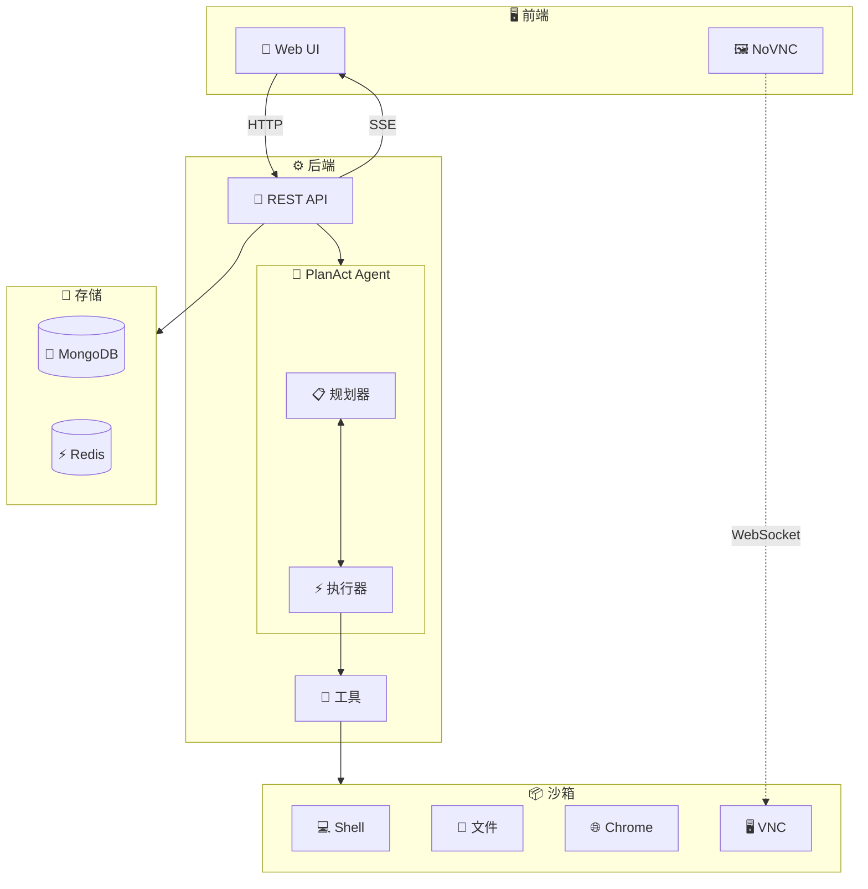

# ManusX - 开源通用智能体

<p align="center">
  <a href="README.md">English</a> | <a href="README_zh.md">中文</a> |
  <a href="https://nuoyimanaituling.github.io/manus-x">📚 文档</a>
</p>

<p align="center">
  
  
  
  
</p>

ManusX 是一个**完全私有部署**的企业级 AI Agent 系统，支持在隔离的沙箱环境中运行各种工具和操作。

构建你自己的 AI 智能体，完全掌控你的数据 - 无需任何外部依赖！

---

## 🎯 为什么选择 ManusX？

- **🏢 企业级**: 完全私有部署，数据不泄露
- **🔧 可扩展**: 内置 Skill 系统和 MCP 协议支持
- **🔒 安全**: 每个任务 Docker 沙箱隔离
- **🚀 简单**: 最小化设置 - 仅需 LLM API
- **🌍 通用**: 兼容 OpenAI、Anthropic、DeepSeek 等

---

## ✨ 核心特性

| 功能 | 说明 |
|------|------|
| **🚀 易部署** | 最小依赖 - 仅需 LLM 服务，无需其它外部服务 |
| **🔧 丰富工具** | Terminal、Browser、File、Web Search，支持实时预览和接管 |
| **📦 隔离沙箱** | 每个任务在独立的 Docker 容器中运行（Ubuntu + Chrome） |
| **💾 会话管理** | MongoDB/Redis 驱动的会话历史和后台任务支持 |
| **💬 交互对话** | 支持停止、中断、文件上传下载和实时流式输出 |
| **🌍 多语言** | 完整的中英文 UI 支持 |
| **🔐 灵活认证** | 多种认证模式：密码、本地或无认证 |
| **🔌 MCP 集成** | Model Context Protocol 无缝扩展工具 |
| **📚 Skill 系统** | 三层加载架构的领域专业知识注入 |
| **⏰ 定时任务** | 内置任务调度和后台执行 |

---

## 🎥 演示

### 浏览器自动化


### Skill 系统


---

## 🚀 快速开始

### 环境要求

- **Docker** 20.10+ 和 Docker Compose
- **LLM API** (OpenAI、Anthropic、DeepSeek 或兼容 OpenAI 的 API)
- 推荐 **8GB+ 内存**

### 一键部署

```bash
# 克隆仓库
git clone https://github.com/nuoyimanaituling/manus-x.git
cd manus-x

# 配置环境变量
cp .env.example .env
# 编辑 .env 并设置你的 API_KEY、API_BASE、MODEL_NAME

# 启动所有服务
./run.sh up -d

# 访问 http://localhost:5173
```

就这么简单！你的 ManusX 实例已经在运行了！🎉

### 关键配置

编辑 `.env` 文件设置：

| 变量 | 必填 | 说明 | 示例 |
|------|------|------|------|
| `API_KEY` | ✅ 是 | LLM API 密钥 | `sk-xxx` |
| `API_BASE` | ✅ 是 | LLM API 基础 URL | `https://api.openai.com/v1` |
| `MODEL_NAME` | ✅ 是 | 模型名称 | `gpt-4o`、`deepseek-chat` |
| `AUTH_PROVIDER` | ⚪ 否 | 认证模式 | `password`（默认）、`local`、`none` |
| `JWT_SECRET_KEY` | ⚠️ 条件 | JWT 密钥 | 当 `AUTH_PROVIDER=password` 时必填 |
| `SEARCH_PROVIDER` | ⚪ 否 | 搜索引擎 | `bing`、`google`、`baidu` |
| `MONGODB_URI` | ⚪ 否 | MongoDB 连接 | `mongodb://mongodb:27017` |
| `REDIS_HOST` | ⚪ 否 | Redis 服务器 | `redis` |

> **注意**: 完整环境变量列表请查看 `.env.example`

---

## 🏗️ 架构设计

### 系统概览



### 请求处理流程

1. **用户**向**前端**发送消息
2. **前端**向**后端**发送 HTTP 请求
3. **后端**为任务创建一个 **Docker 沙箱**
4. **Plan-Act Agent** 分析任务并生成执行计划
5. **Execution Agent** 在**沙箱**中调用工具（Browser/Shell/File）
6. 实时事件通过 **SSE** 流式传回**前端**
7. 用户看到实时更新并可以与工具交互

### 后端架构（DDD）

ManusX 遵循**领域驱动设计**原则：

- **接口层** (`interfaces/`): FastAPI 路由和 API 模式
- **应用层** (`application/`): 服务编排
- **领域层** (`domain/`):
  - **模型**: Plan、Step、Message、Skill
  - **智能体**: Planner Agent、Execution Agent
  - **工具**: Browser、Shell、File、Search、Message
- **基础设施层** (`infrastructure/`):
  - **LLM**: OpenAI、Anthropic 实现
  - **沙箱**: Docker 容器管理
  - **数据库**: MongoDB 和 Redis 适配器

---

## 🛠️ 技术栈

### 前端
- **框架**: Vue 3（Composition API）+ TypeScript + Vite
- **UI**: Tailwind CSS + shadcn-vue
- **代码编辑器**: Monaco Editor
- **远程桌面**: NoVNC（基于 WebSocket 的 VNC 客户端）
- **国际化**: vue-i18n

### 后端
- **框架**: FastAPI + Python 3.11+
- **架构**: 领域驱动设计（DDD）
- **数据库**:
  - MongoDB（会话、消息、文件）
  - Redis（缓存、pub/sub、任务队列）
- **LLM 客户端**: OpenAI SDK、Anthropic SDK
- **异步**: Motor（MongoDB）、aioredis

### 沙箱
- **基础镜像**: Ubuntu 22.04
- **浏览器**: Google Chrome with CDP（Chrome DevTools Protocol）
- **进程管理**: Supervisor
- **服务**:
  - FastAPI 服务器（8080）- Shell/File APIs
  - VNC Server（5900）- 远程桌面
  - Chrome（9222）- CDP 调试
  - WebSockify（5901）- VNC 到 WebSocket 代理

### 基础设施
- **容器**: Docker + Docker Compose
- **CI/CD**: GitHub Actions
- **镜像仓库**: Docker Hub (`dockerdockerdockerxzw`)

---

## 👨‍💻 开发指南

### 启动开发环境

```bash
# 启动所有服务（热重载）
./dev.sh up

# 查看日志
./dev.sh logs -f [backend|frontend|sandbox]

# 停止服务
./dev.sh down

# 依赖变更后重新构建
./dev.sh down -v && ./dev.sh build && ./dev.sh up
```

**开发模式暴露的端口:**
- `5173` - 前端（Vite 开发服务器）
- `8000` - 后端 API
- `8080` - 沙箱 API
- `5900` - 沙箱 VNC
- `9222` - Chrome DevTools Protocol

### 后端测试

```bash
cd backend

# 运行所有测试
pytest

# 运行特定测试文件
pytest tests/test_api_file.py

# 运行特定测试
pytest tests/test_api_file.py::test_name

# 带覆盖率运行
pytest --cov=app tests/
```

### 前端开发

```bash
cd frontend

# 启动开发服务器
npm run dev

# 生产构建
npm run build

# 类型检查
npm run type-check

# 代码检查
npm run lint
```

### 项目结构

```
manusx/
├── frontend/                 # Vue 3 前端
│   ├── src/
│   │   ├── pages/           # 页面组件
│   │   ├── components/      # 可复用组件
│   │   ├── api/            # API 客户端
│   │   └── locales/        # i18n 翻译
│   └── package.json
│
├── backend/                 # FastAPI 后端
│   ├── app/
│   │   ├── domain/         # 领域层
│   │   │   ├── models/     # 领域模型
│   │   │   └── services/   # 领域服务
│   │   │       ├── agents/ # Planner & Execution agents
│   │   │       └── tools/  # 工具实现
│   │   ├── application/    # 应用层
│   │   ├── infrastructure/ # 基础设施层
│   │   └── interfaces/     # 接口层（API 路由）
│   ├── skills/            # Skill 定义
│   └── requirements.txt
│
├── sandbox/                # Docker 沙箱
│   ├── Dockerfile
│   └── supervisord.conf
│
├── docs/                   # 文档
├── docker-compose.yml     # 生产部署
├── docker-compose-development.yml  # 开发环境
├── .env.example           # 环境变量模板
├── dev.sh                 # 开发脚本
└── run.sh                 # 生产脚本
```

---

## 🚢 部署指南

### 生产部署

```bash
# 使用 run.sh 脚本
./run.sh up -d

# 或直接使用 docker-compose
docker compose up -d
```

### 构建自定义镜像

```bash
# 设置你的镜像仓库和标签
export IMAGE_REGISTRY=your-registry-url
export IMAGE_TAG=v1.0.0

# 构建镜像
./build.sh

# 推送到镜像仓库
./run.sh push
```

### Kubernetes 部署

Kubernetes 部署请参考我们的 [K8s 部署指南](docs/deployment/kubernetes.md)。

### 环境特定配置

**开发环境** (`.env.development`):
```env
NODE_ENV=development
API_BASE=http://localhost:8000
LOG_LEVEL=DEBUG
```

**生产环境** (`.env.production`):
```env
NODE_ENV=production
API_BASE=https://your-domain.com/api
LOG_LEVEL=INFO
```

---

## ❓ 常见问题

<details>
<summary><b>Q: 可以使用本地 LLM 模型吗？</b></summary>

可以！ManusX 支持任何兼容 OpenAI 的 API 端点。你可以使用：
- **Ollama**: 运行 `ollama serve` 并设置 `API_BASE=http://localhost:11434/v1`
- **LocalAI**: 开箱即用
- **vLLM**: 设置合适的 API_BASE
- **Text Generation Inference**: Hugging Face 的 TGI

只需将 `API_BASE` 配置为指向你的本地 LLM 端点。
</details>

<details>
<summary><b>Q: 如何启用网络搜索？</b></summary>

在 `.env` 中配置搜索引擎：

```env
SEARCH_PROVIDER=bing
BING_SEARCH_KEY=your-bing-api-key
```

**支持的搜索引擎:**
- `bing` - 需要 `BING_SEARCH_KEY`
- `google` - 需要 `GOOGLE_SEARCH_API_KEY` 和 `GOOGLE_SEARCH_ENGINE_ID`
- `baidu` - 无需 API 密钥（使用网页抓取）
</details>

<details>
<summary><b>Q: 如何添加自定义 Skill？</b></summary>

在 `backend/skills/` 下创建新的 skill 目录：

```bash
backend/skills/my-skill/
├── SKILL.md          # Skill 定义（YAML frontmatter + Markdown）
├── scripts/          # 可执行脚本
├── references/       # 参考文档
└── assets/           # 静态资源（模板、配置）
```

**SKILL.md 示例:**
```markdown
---
name: my-skill
description: 简要描述这个 skill 的功能
---

# My Skill 标题

详细说明 LLM 如何使用这个 skill...
```

更多详情请查看 [Skill 系统文档](docs/skill.md)。
</details>

<details>
<summary><b>Q: 如何配置 MCP 服务器？</b></summary>

创建 `mcp_config.json` 文件：

```json
{
  "mcpServers": {
    "filesystem": {
      "command": "npx",
      "args": ["-y", "@modelcontextprotocol/server-filesystem", "/workspace"]
    },
    "github": {
      "command": "npx",
      "args": ["-y", "@modelcontextprotocol/server-github"],
      "env": {
        "GITHUB_TOKEN": "your-token"
      }
    }
  }
}
```

在 `docker-compose.yml` 中挂载：
```yaml
volumes:
  - ./mcp_config.json:/app/mcp_config.json
```

设置环境变量：
```env
MCP_CONFIG_PATH=/app/mcp_config.json
```
</details>

<details>
<summary><b>Q: 推荐使用哪些 LLM 模型？</b></summary>

**推荐模型:**
- **OpenAI**: `gpt-4o`、`gpt-4-turbo`
- **Anthropic**: `claude-3-5-sonnet`、`claude-3-opus`
- **DeepSeek**: `deepseek-chat`、`deepseek-coder`

**要求:**
- 兼容 OpenAI 的 API
- 支持函数调用（Function Calling）
- 支持 JSON 格式输出
</details>

<details>
<summary><b>Q: 如何配置认证？</b></summary>

ManusX 支持三种认证模式：

**1. 密码认证**（默认）:
```env
AUTH_PROVIDER=password
JWT_SECRET_KEY=your-random-secret-key
PASSWORD_SALT=your-password-salt
```
用户可以用邮箱/密码注册和登录。

**2. 本地认证**（单个管理员用户）:
```env
AUTH_PROVIDER=local
LOCAL_AUTH_EMAIL=admin@example.com
LOCAL_AUTH_PASSWORD=your-secure-password
```

**3. 无认证**:
```env
AUTH_PROVIDER=none
```
⚠️ 警告：仅在可信环境中使用！
</details>

---

## 🤝 参与贡献

我们欢迎社区贡献！

### 如何贡献

1. 🍴 Fork 仓库
2. 🌿 创建你的特性分支 (`git checkout -b feature/amazing-feature`)
3. ✅ 提交你的改动 (`git commit -m '添加某个很棒的特性'`)
4. 📤 推送到分支 (`git push origin feature/amazing-feature`)
5. 🎉 开启一个 Pull Request

### 开发指南

- Python 代码遵循 **PEP 8** 规范
- 前端代码使用 **TypeScript**
- 为新特性编写测试
- 更新用户相关的文档
- 保持提交原子化和良好的描述

### 发现 Bug？

[开启一个 issue](https://github.com/nuoyimanaituling/manus-x/issues) 并包含：
- Bug 描述
- 重现步骤
- 预期行为 vs 实际行为
- 环境详情（OS、Docker 版本等）

---

## 💬 社区与支持

- **📝 文档**: [完整文档](https://nuoyimanaituling.github.io/manus-x)
- **💬 讨论**: [GitHub Discussions](https://github.com/nuoyimanaituling/manus-x/discussions)
- **🐛 Bug 报告**: [GitHub Issues](https://github.com/nuoyimanaituling/manus-x/issues)

---

## 📄 开源协议

本项目基于 **MIT 协议** 开源 - 详见 [LICENSE](LICENSE) 文件。

---

## ⭐ Star 历史

[](https://star-history.com/#nuoyimanaituling/manus-x&Date)

---

<p align="center">
  由 ManusX 团队用 ❤️ 制作
</p>

<p align="center">
  <sub>如果你觉得这个项目有用，请给它一个 ⭐️！</sub>
</p>
