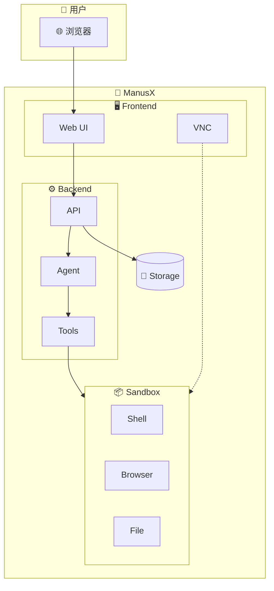
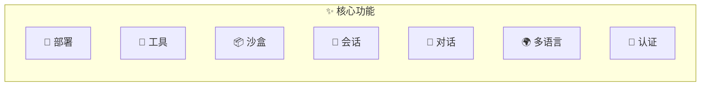

# ManusX 开源通用智能体

项目地址：<https://github.com/nuoyimanaituling/manus-x>

---

ManusX 是一个通用的 AI Agent 系统，可以完全私有部署，支持在沙盒环境中运行各种工具和操作。ManusX是对开源ai-manus项目的一个增强

ManusX 项目目标是希望成为可完全私有部署的企业级 Manus 应用。垂类 Manus 的应用有多种重复性的工程化工作，这个项目希望把这部分统一，让大家可以像搭积木一下建立起一个垂类 Manus 应用。

---

## 系统架构概览



## 演示

### 浏览器自动化


### Skill 系统


## 核心功能



| 功能 | 说明                                     |
|------|----------------------------------------|
| **🚀 部署** | 最小只需一个 LLM 服务即可部署                      |
| **🔧 工具** | Terminal、Browser、File、Search、 skill 工具 |
| **📦 沙盒** | 每个任务独立 Docker 沙盒                       |
| **💾 会话** | Mongo/Redis 管理会话历史                     |
| **💬 对话** | 支持停止、打断、文件上传下载                         |
| **🌍 多语言** | 中文 / 英文                                |
| **🔐 认证** | 用户登录认证                                 |


## 快速开始

```bash
# 克隆项目
git clone https://github.com/nuoyimanaituling/manus-x.git
cd manus-x

# 配置环境变量
cp .env.example .env

# 启动服务
./run.sh up -d

# 访问 http://localhost:5173
```

详细部署指南请参考 [快速开始](quick_start.md)。
