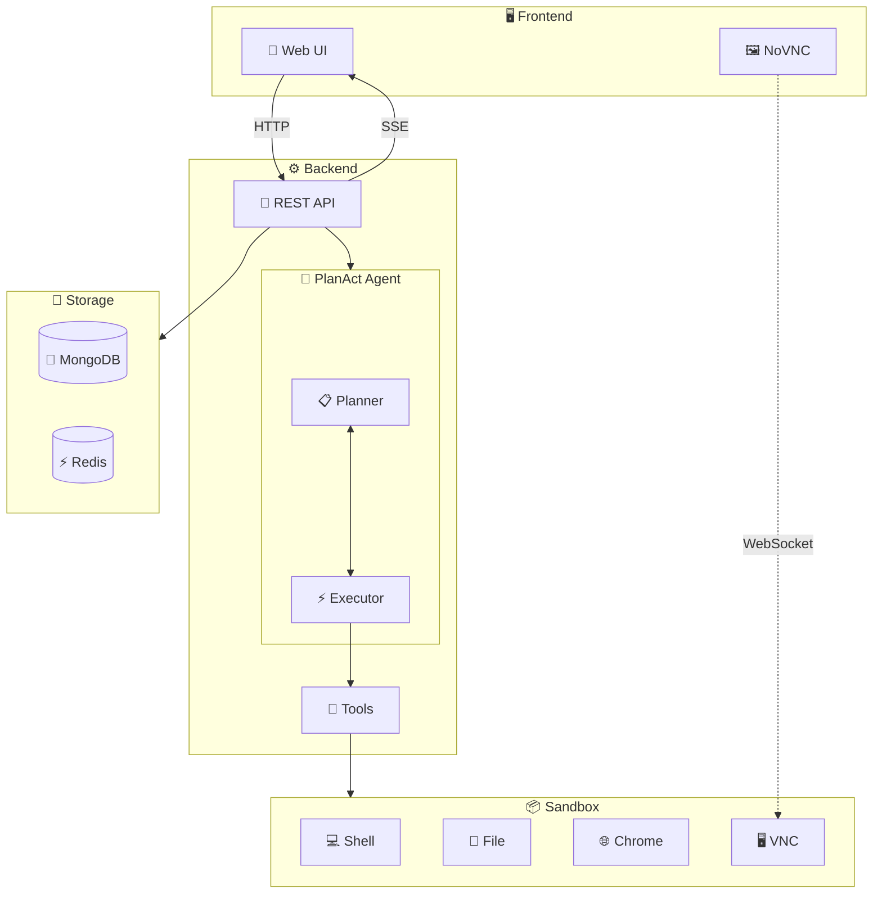
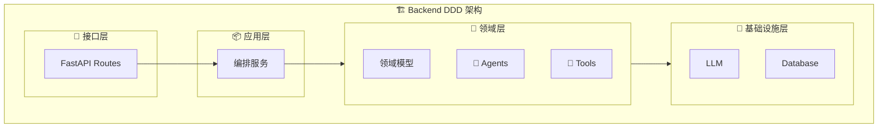
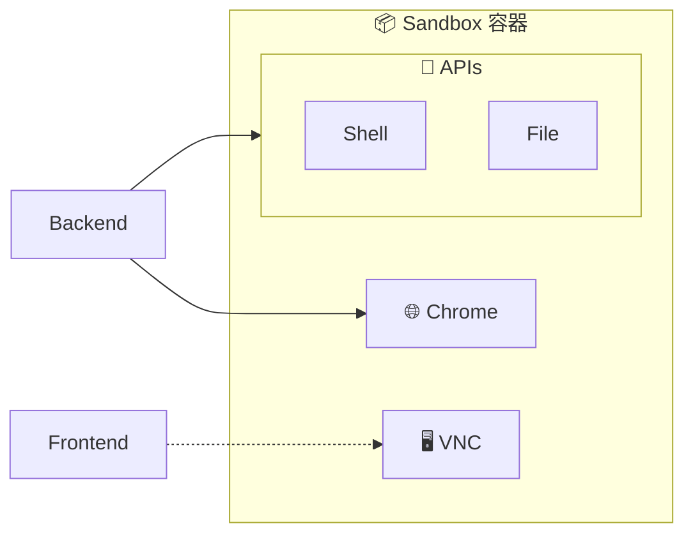
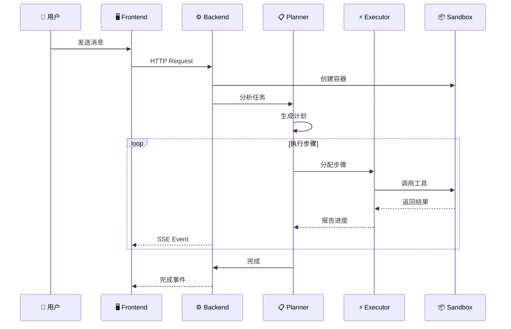
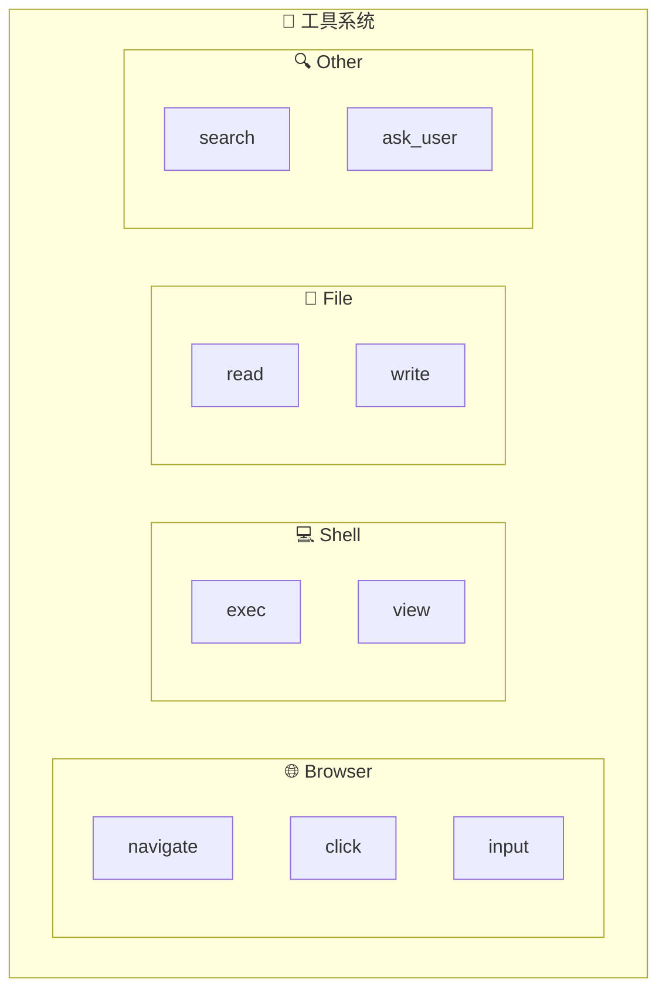
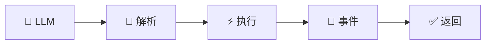
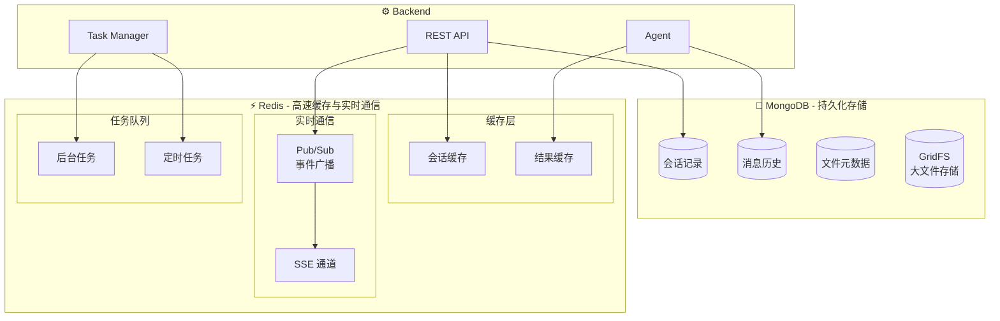
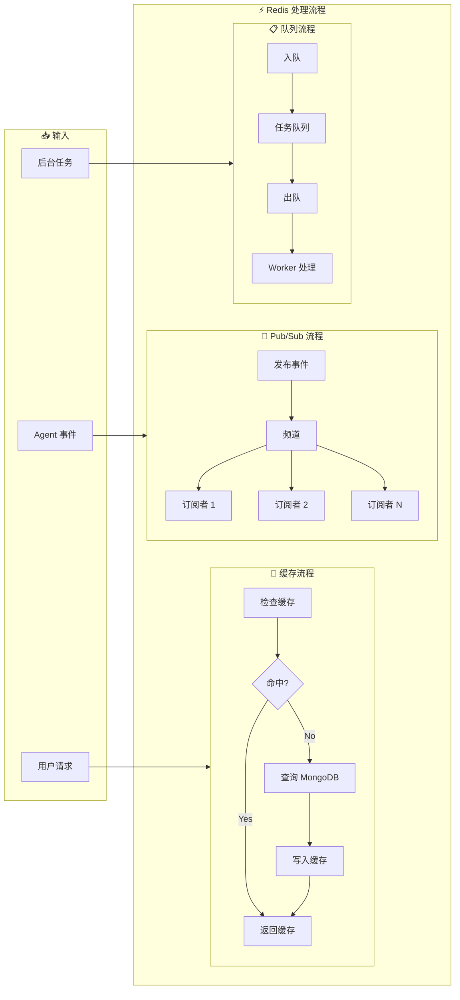
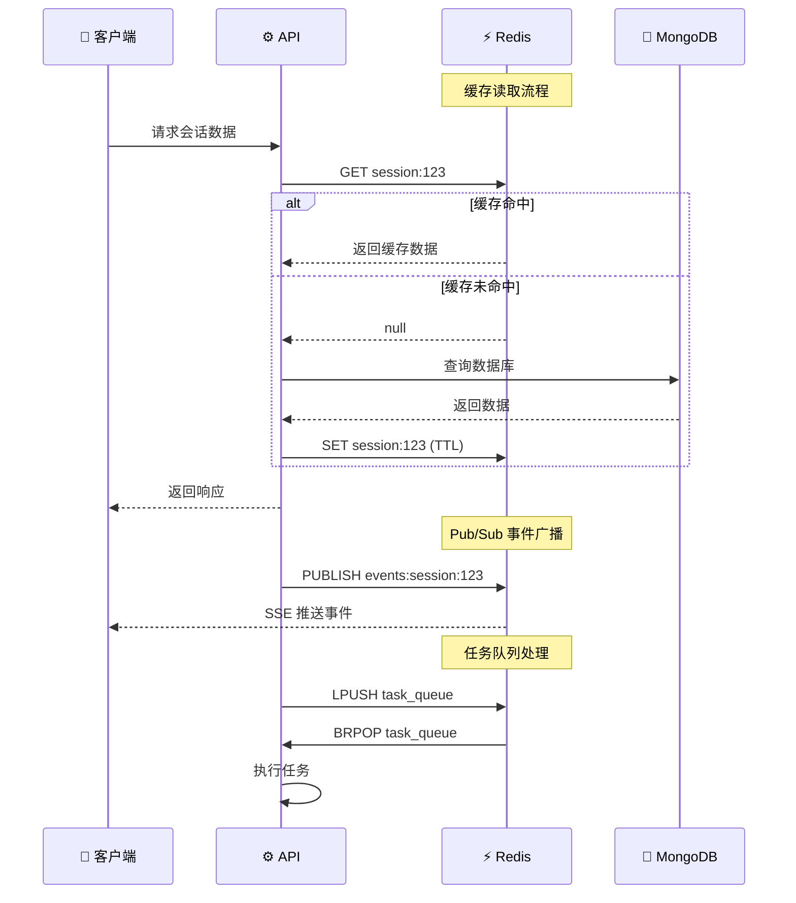

# 系统架构

## 整体设计

## 核心组件

### 1. Frontend (前端)

- **技术栈**: Vue 3 + TypeScript + Vite
- **主要功能**:
  - 聊天界面 (ChatPage)
  - 浏览器远程预览 (NoVNC)
  - 实时事件展示 (SSE)

### 2. Backend (后端)

- **技术栈**: FastAPI + Python
- **架构模式**: DDD (领域驱动设计)

### 3. Sandbox (沙箱)

- **基础镜像**: Ubuntu 22.04
- **进程管理**: Supervisor
- **内置服务**:

| 服务 | 端口 | 用途 |
|------|------|------|
| FastAPI | 8080 | Shell/File API |
| Chrome | 9222 | CDP 远程调试 |
| VNC | 5900 | 远程桌面 |
| WebSockify | 5901 | WebSocket 代理 |

## 请求处理流程

## 工具系统

| 工具类别 | 工具名称 | 功能 |
|---------|---------|------|
| **Browser** | navigate | 访问 URL |
| | click | 点击元素 |
| | input | 输入文本 |
| | view | 查看页面 |
| **Shell** | exec | 执行命令 |
| | view | 查看输出 |
| **File** | read | 读取文件 |
| | write | 写入文件 |
| **Search** | web_search | 网络搜索 |

### 工具调用流程

## 数据存储

### 整体架构

### 用户任务处理流程

### 关键功能

| 功能 | 用途 | 数据结构 |
|------|------|----------|
| **会话缓存** | 加速会话数据读取 | String/Hash |
| **结果缓存** | 缓存工具执行结果 | String |
| **Pub/Sub** | SSE 事件实时广播 | Channel |
| **任务队列** | 后台任务调度 | List/Sorted Set |
| **定时任务** | 定时执行任务 | Sorted Set |
| **分布式锁** | 防止并发冲突 | String + SETNX |

### 数据流时序

## 配置说明

| 变量 | 说明 |
|------|------|
| `API_KEY` | LLM API 密钥 |
| `API_BASE` | LLM API 地址 |
| `MODEL_NAME` | 模型名称 |
| `SANDBOX_IMAGE` | Docker 镜像 |
| `AUTH_PROVIDER` | 认证方式 |
