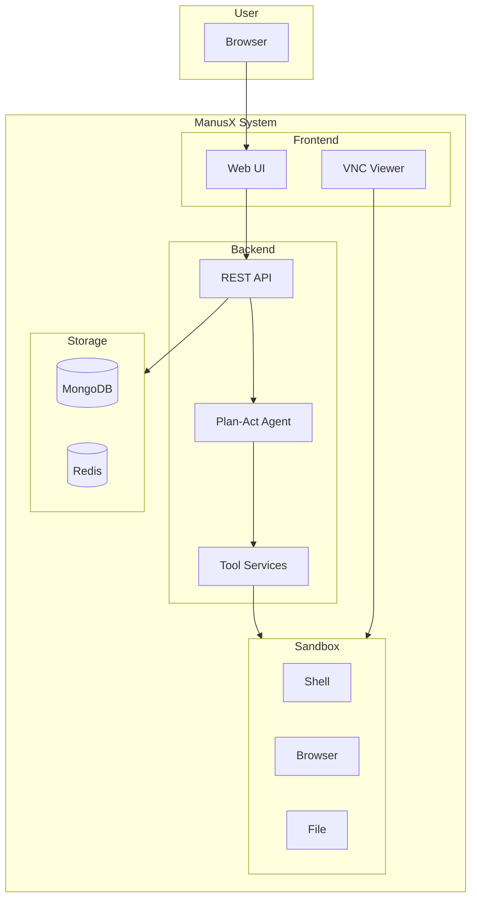
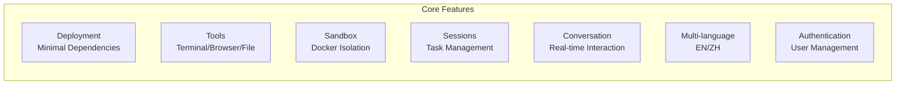
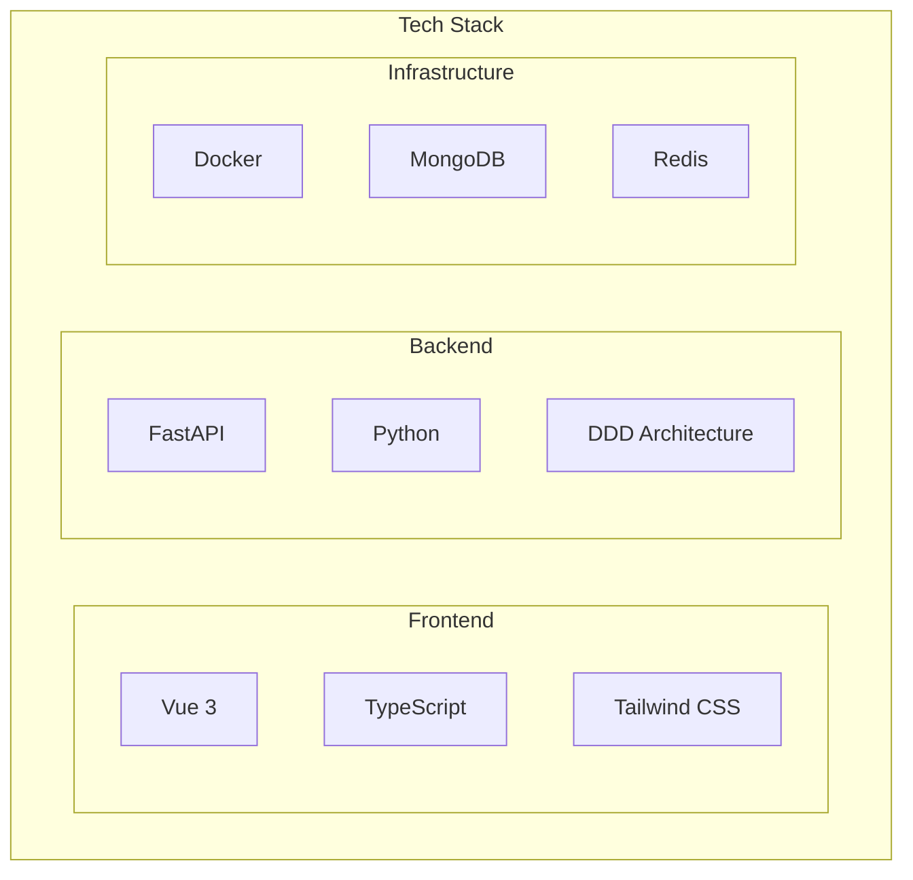

# ManusX - Open Source General AI Agent

Project URL: <https://github.com/nuoyimanaituling/manus-x>

---

ManusX is a general-purpose AI Agent system that can be fully privately deployed and supports running various tools and operations in a sandbox environment.

The goal of ManusX project is to become a fully privately deployable enterprise-level Manus application. Vertical Manus applications have many repetitive engineering tasks, and this project hopes to unify this part, allowing everyone to build vertical Manus applications like building blocks.

Each service and tool in ManusX includes a Built-in version that can be fully privately deployed. Later, through A2A and MCP protocols, both Built-in Agents and Tools can be replaced. The underlying infrastructure can also be replaced by providing diverse provider configurations or simple development adaptations. ManusX supports distributed multi-instance deployment from the architectural design, facilitating horizontal scaling to meet enterprise-level deployment requirements.

---

## System Architecture Overview



## Demo

### Browser Automation


### Skill System


## Core Features



| Feature | Description |
|---------|-------------|
| **Deployment** | Only requires one LLM service for deployment, no dependency on other external services |
| **Tools** | Supports Terminal, Browser, File, Web Search, message tools, with real-time viewing and takeover capabilities |
| **Sandbox** | Each Task is allocated a separate sandbox that runs in a local Docker environment |
| **Task Sessions** | Manages session history through Mongo/Redis, supports background tasks |
| **Conversations** | Supports stopping and interruption, supports file upload and download |
| **Multi-language** | Supports Chinese and English |
| **Authentication** | User login and authentication |

## Tech Stack



## Quick Start

```bash
# Clone the project
git clone https://github.com/nuoyimanaituling/manus-x.git
cd manus-x

# Configure environment variables
cp .env.example .env
# Edit .env file, configure API_KEY etc.

# Start services
./run.sh up -d

# Visit http://localhost:5173
```

For detailed deployment guide, see [Quick Start](quick_start.md).
