# System Architecture

## Overall Design

## Core Components

### 1. Frontend

- **Tech Stack**: Vue 3 + TypeScript + Vite
- **Main Features**:
  - Chat Interface (ChatPage)
  - Remote Browser Preview (NoVNC)
  - Real-time Event Display (SSE)

### 2. Backend

- **Tech Stack**: FastAPI + Python
- **Architecture Pattern**: DDD (Domain-Driven Design)

### 3. Sandbox

- **Base Image**: Ubuntu 22.04
- **Process Manager**: Supervisor
- **Built-in Services**:

| Service | Port | Purpose |
|---------|------|---------|
| FastAPI | 8080 | Shell/File API |
| Chrome | 9222 | CDP Remote Debugging |
| VNC | 5900 | Remote Desktop |
| WebSockify | 5901 | VNC WebSocket Proxy |

## Request Processing Flow

## Tool System

### Available Tools

| Category | Tool Name | Function |
|----------|-----------|----------|
| **Browser** | browser_navigate | Visit URL |
| | browser_click | Click Element |
| | browser_input | Input Text |
| | browser_view | View Page Content |
| | browser_scroll_up/down | Scroll Page |
| **Shell** | shell_exec | Execute Command |
| | shell_view | View Output |
| | shell_write | Write Input |
| **File** | file_read | Read File |
| | file_write | Write File |
| | file_search | Search Files |
| **Search** | web_search | Web Search |
| **Message** | message_ask_user | Ask User |

### Tool Invocation Flow

## Data Storage

### Overall Architecture

### Redis Functionality Flow

```mermaid
flowchart LR
    subgraph Input["📥 Input"]
        Request["User Request"]
        Event["Agent Event"]
        Task["Background Task"]
    end

    subgraph RedisFlow["⚡ Redis Processing Flow"]
        direction TB
        subgraph CacheFlow["🔄 Cache Flow"]
            Check["Check Cache"] --> Hit{"Hit?"}
            Hit -->|"Yes"| Return["Return Cached"]
            Hit -->|"No"| Query["Query MongoDB"]
            Query --> Store["Write to Cache"]
            Store --> Return
        end

        subgraph PubSubFlow["📡 Pub/Sub Flow"]
            Publish["Publish Event"] --> Channel["Channel"]
            Channel --> Sub1["Subscriber 1"]
            Channel --> Sub2["Subscriber 2"]
            Channel --> SubN["Subscriber N"]
        end

        subgraph QueueFlow["📋 Queue Flow"]
            Push["Enqueue"] --> Queue["Task Queue"]
            Queue --> Pop["Dequeue"]
            Pop --> Worker["Worker Process"]
        end
    end

    Request --> CacheFlow
    Event --> PubSubFlow
    Task --> QueueFlow
```

### Redis Core Functions

| Function | Purpose | Data Structure |
|----------|---------|----------------|
| **Session Cache** | Accelerate session data reads | String/Hash |
| **Result Cache** | Cache tool execution results | String |
| **Pub/Sub** | SSE event real-time broadcasting | Channel |
| **Task Queue** | Background task scheduling | List/Sorted Set |
| **Scheduled Tasks** | Timed task execution | Sorted Set |
| **Distributed Lock** | Prevent concurrent conflicts | String + SETNX |

### Data Flow Sequence

```mermaid
sequenceDiagram
    participant C as 👤 Client
    participant A as ⚙️ API
    participant R as ⚡ Redis
    participant M as 🍃 MongoDB

    Note over R: Cache Read Flow
    C->>A: Request Session Data
    A->>R: GET session:123
    alt Cache Hit
        R-->>A: Return Cached Data
    else Cache Miss
        R-->>A: null
        A->>M: Query Database
        M-->>A: Return Data
        A->>R: SET session:123 (TTL)
    end
    A-->>C: Return Response

    Note over R: Pub/Sub Event Broadcasting
    A->>R: PUBLISH events:session:123
    R-->>C: SSE Push Event

    Note over R: Task Queue Processing
    A->>R: LPUSH task_queue
    R->>A: BRPOP task_queue
    A->>A: Execute Task
```

## Configuration

Key Environment Variables:

| Variable | Description |
|----------|-------------|
| `API_KEY` | LLM API Key |
| `API_BASE` | LLM API Base URL |
| `MODEL_NAME` | Model Name |
| `SANDBOX_IMAGE` | Sandbox Docker Image |
| `AUTH_PROVIDER` | Auth Mode (password/local/none) |
