# Plan Agent Implementation

## Overview

Plan Agent is the core component of ManusX, implementing a **Plan-Act** pattern for task planning and execution. This pattern breaks down complex tasks into manageable steps and completes objectives through iterative execution and dynamic adjustment.

## Architecture Design

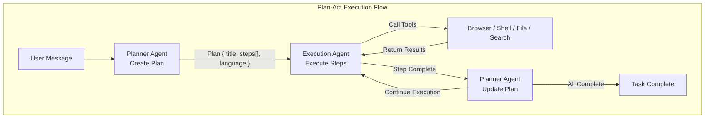

### State Transitions

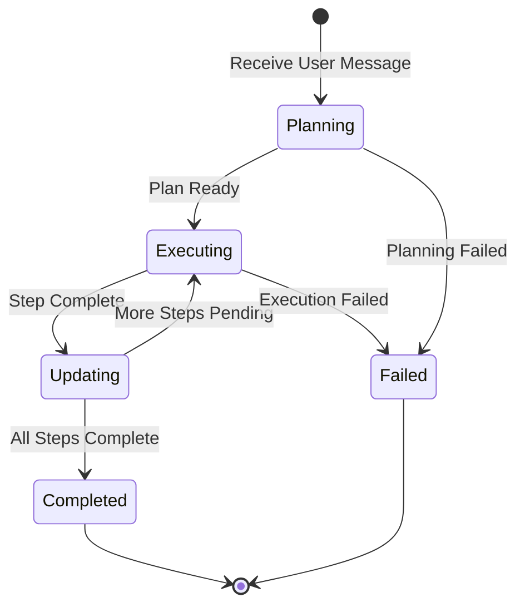

## Core Models

### Plan Model

```python
# backend/app/domain/models/plan.py

class Plan(BaseModel):
    title: str              # Plan title
    steps: List[Step]       # Execution steps list
    language: str = "en"    # Response language
```

### Step Model

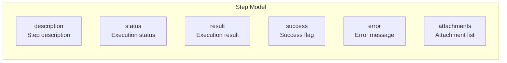

```python
class Step(BaseModel):
    description: str                    # Step description
    status: ExecutionStatus = PENDING   # Execution status
    result: Optional[str] = None        # Execution result
    success: Optional[bool] = None      # Success flag
    error: Optional[str] = None         # Error message
    attachments: List[str] = []         # Attachment list

class ExecutionStatus(str, Enum):
    PENDING = "pending"       # Pending
    RUNNING = "running"       # Running
    COMPLETED = "completed"   # Completed
    FAILED = "failed"         # Failed
```

### Status Transitions

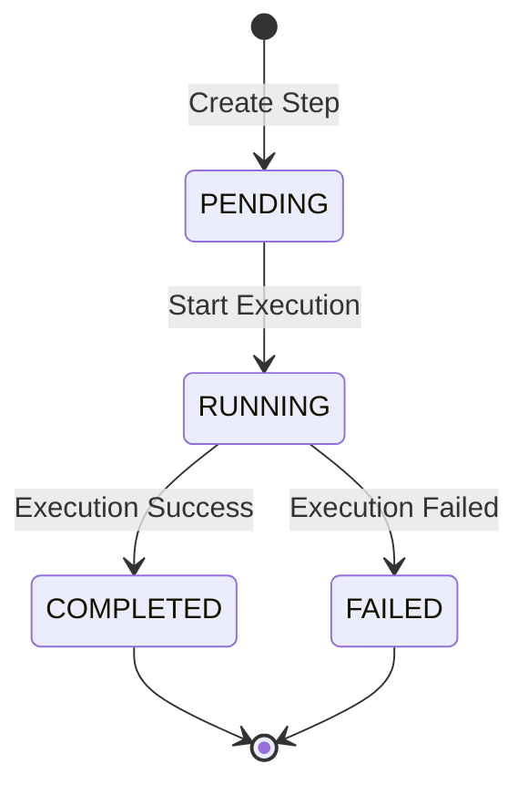

## Core Components

### 1. Planner Agent

**Responsibility**: Analyze user requirements, generate and update execution plans

**Key File**: `backend/app/domain/services/agents/planner.py`

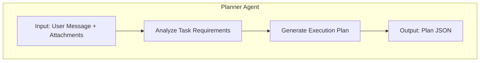

### 2. Execution Agent

**Responsibility**: Execute each step in the plan, call tools to complete specific tasks

**Key File**: `backend/app/domain/services/agents/execution.py`

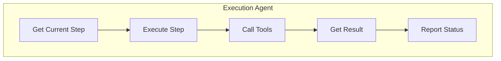

### 3. Base Agent

**Responsibility**: Provide base Agent capabilities including LLM calls, tool execution, state management

**Key File**: `backend/app/domain/services/agents/base.py`

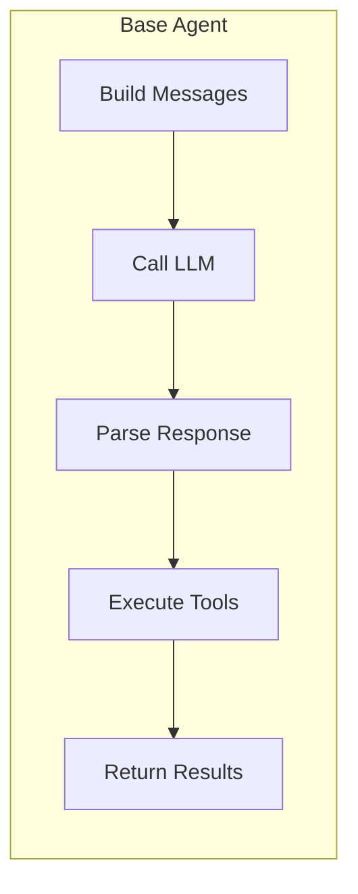

## Execution Flow Details

### Complete Execution Sequence

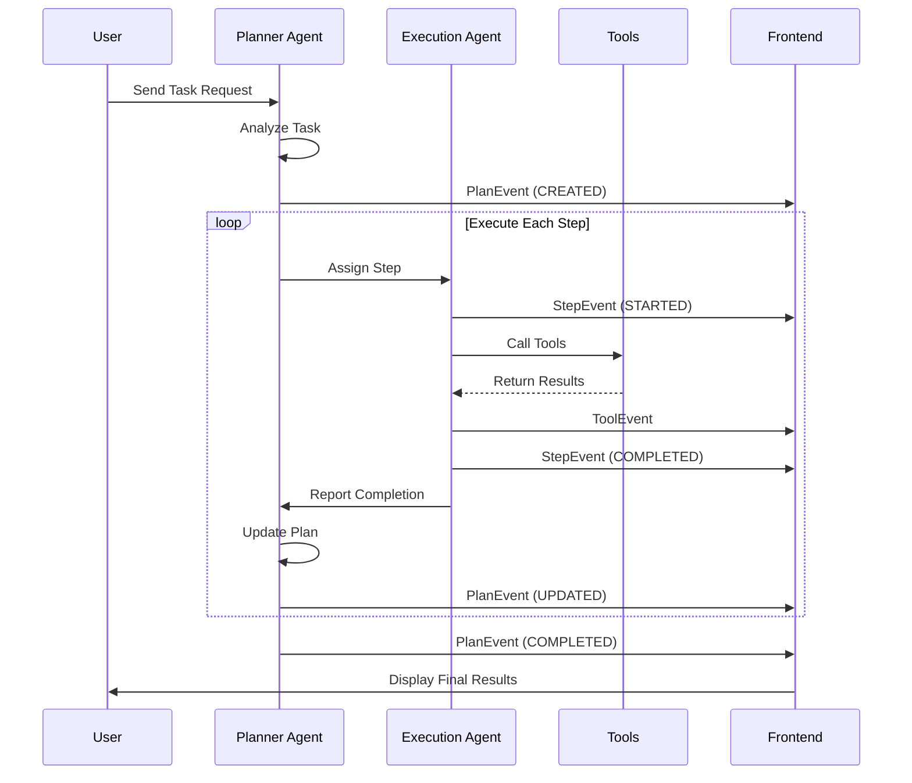

### 1. Plan Creation Phase

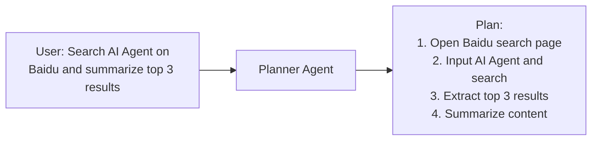

### 2. Step Execution Phase

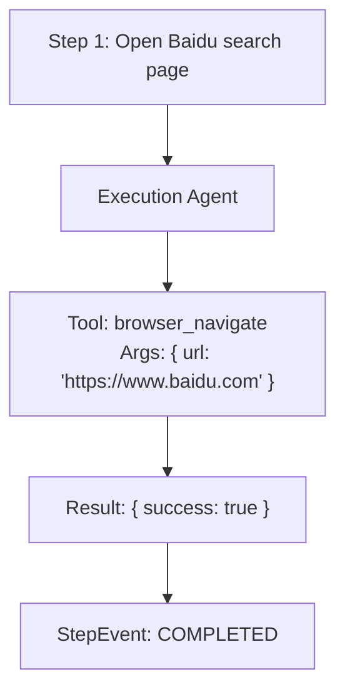

### 3. Plan Update Phase

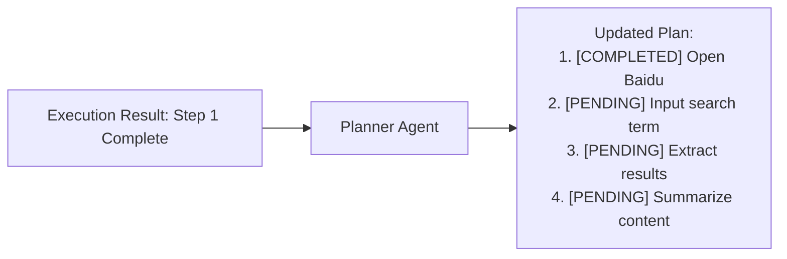

## Event System

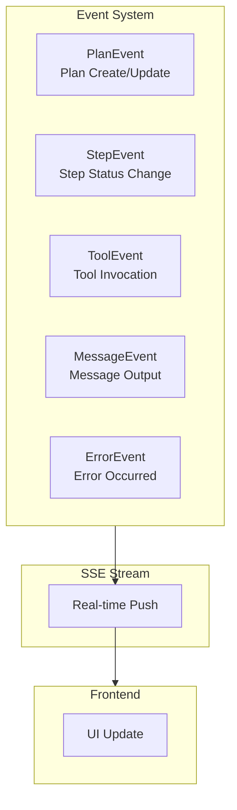

| Event Type | Description | Data |
|------------|-------------|------|
| `PlanEvent` | Plan create/update | Plan object |
| `StepEvent` | Step status change | Step object |
| `ToolEvent` | Tool invocation | Tool name, args, result |
| `MessageEvent` | Message output | Text content |
| `ErrorEvent` | Error occurred | Error message |

## Key Files

| File Path | Function |
|-----------|----------|
| `domain/services/agents/planner.py` | Planner Agent implementation |
| `domain/services/agents/execution.py` | Execution Agent implementation |
| `domain/services/agents/base.py` | Agent base class |
| `domain/models/plan.py` | Plan/Step model definitions |
| `domain/services/prompts/planner.py` | Planner Prompt templates |
| `domain/services/prompts/execution.py` | Execution Prompt templates |
