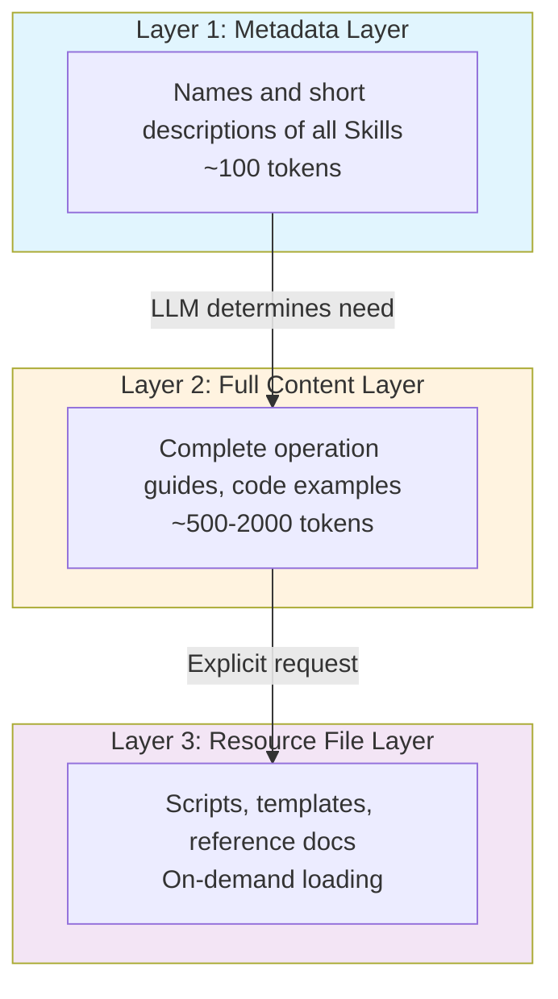
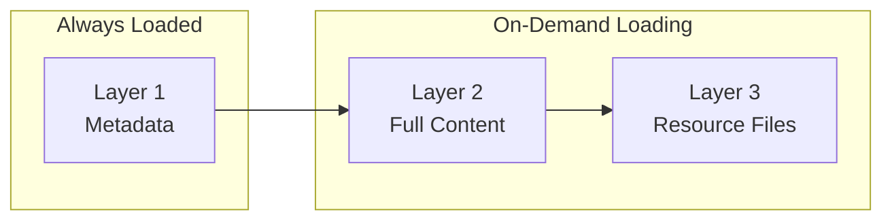
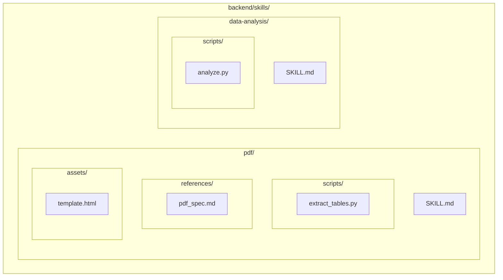
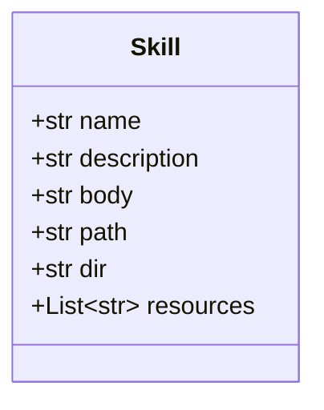
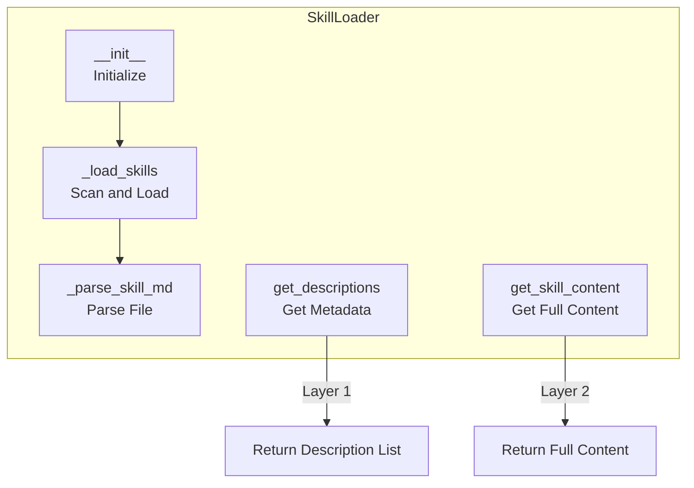
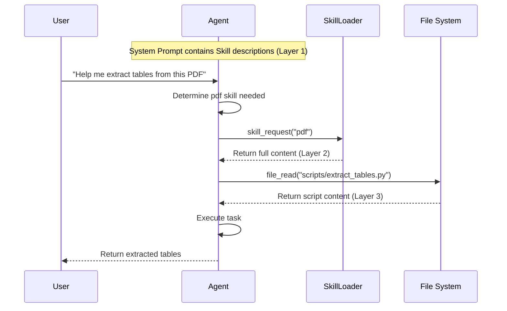
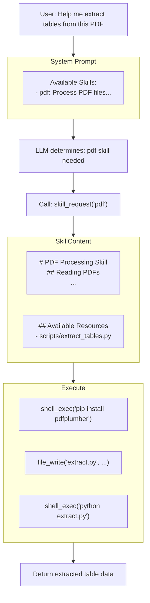
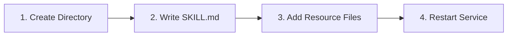
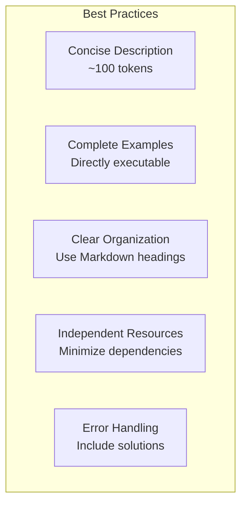

# Skill System Implementation

## Overview

The Skill system provides **domain expertise injection** capabilities for ManusX. Through Skills, Agents can gain professional operation guides and best practices in specific domains (such as PDF processing, data analysis, etc.).

## Design Philosophy

### Three-Layer Loading Architecture





### Layer Details

| Layer | Load Timing | Content | Token Cost |
|-------|-------------|---------|------------|
| **Layer 1** | Always loaded | Skill names and short descriptions | ~100 |
| **Layer 2** | On-demand | Complete operation guides, code examples | ~500-2000 |
| **Layer 3** | Explicit request | Scripts, templates, reference docs | As needed |

## Directory Structure



```
backend/skills/
├── pdf/
│   ├── SKILL.md              # Skill definition file
│   ├── scripts/              # Executable scripts
│   │   └── extract_tables.py
│   ├── references/           # Reference documents
│   │   └── pdf_spec.md
│   └── assets/               # Static assets
│       └── template.html
└── data-analysis/
    ├── SKILL.md
    └── scripts/
        └── analyze.py
```

## SKILL.md File Format

Each Skill is defined through a `SKILL.md` file using **YAML frontmatter + Markdown body** format:

```mermaid
flowchart TB
    subgraph SkillMD["SKILL.md File Structure"]
        subgraph YAML["YAML Frontmatter"]
            Name["name: pdf"]
            Desc["description: Process PDF files..."]
        end
        subgraph Body["Markdown Body"]
            Title["# PDF Processing Skill"]
            Section1["## Reading PDFs"]
            Code["```python...```"]
            Section2["## Key Libraries"]
        end
    end

    YAML --> Body
```

### Field Description

| Field | Required | Description |
|-------|----------|-------------|
| `name` | Yes | Unique Skill identifier |
| `description` | Yes | Short description (~100 tokens) |
| `body` | Yes | Markdown body content |

## Core Implementation

### Skill Model



```python
# backend/app/domain/models/skill.py

class Skill(BaseModel):
    name: str              # Unique identifier
    description: str       # Short description
    body: str              # Full content
    path: str              # SKILL.md file path
    dir: str               # Skill directory path
    resources: List[str]   # Available resource files list
```

### SkillLoader Class



## Usage Flow

### Complete Flow Sequence



## Execution Flow Diagram



## Creating New Skills



### 1. Create Directory Structure

```bash
mkdir -p backend/skills/my-skill/{scripts,references,assets}
```

### 2. Write SKILL.md

```markdown
---
name: my-skill
description: Brief description of what this skill does (~100 tokens)
---

# My Skill Title

Detailed instructions for the LLM.

## Section 1

Instructions and code examples...

## Section 2

More instructions...
```

### 3. Add Resource Files (Optional)

```bash
# Scripts
echo "print('Hello')" > backend/skills/my-skill/scripts/helper.py

# Templates
echo "<html>...</html>" > backend/skills/my-skill/assets/template.html
```

### 4. Restart Service

Skills are automatically loaded when the service starts.

## Best Practices



1. **Concise Description**: Keep `description` field under 100 tokens
2. **Complete Examples**: Provide code examples that can be directly copied and executed
3. **Clear Organization**: Use Markdown headings to organize content
4. **Independent Resources**: Scripts should run independently with minimal dependencies
5. **Error Handling**: Include solutions for common errors

## Key Files

| File Path | Function |
|-----------|----------|
| `domain/models/skill.py` | Skill model definition |
| `domain/services/skill_loader.py` | Skill loader |
| `skills/*/SKILL.md` | Individual Skill definition files |
