# Plan Agent 实现原理

## 概述

Plan Agent 是 ManusX 的核心组件，采用 **Plan-Act** 模式实现任务的规划与执行。该模式将复杂任务分解为可管理的步骤，并通过迭代执行和动态调整来完成目标。

## 架构设计

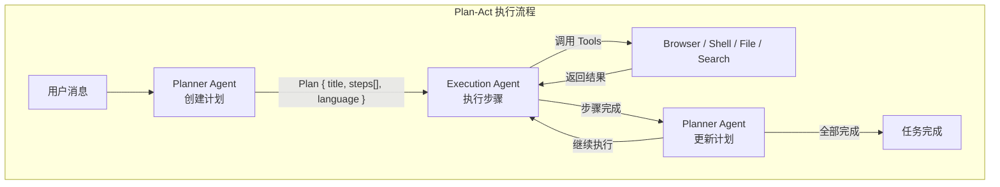

### 状态流转

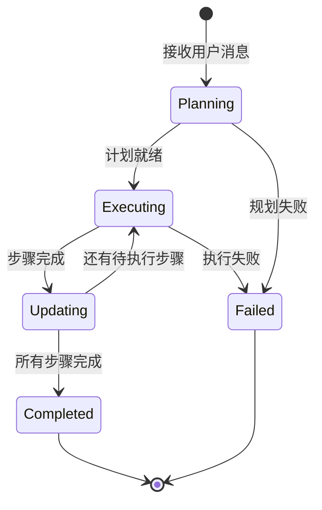

## 核心模型

### Plan 模型

```python
# backend/app/domain/models/plan.py

class Plan(BaseModel):
    title: str              # 计划标题
    steps: List[Step]       # 执行步骤列表
    language: str = "en"    # 响应语言
```

### Step 模型

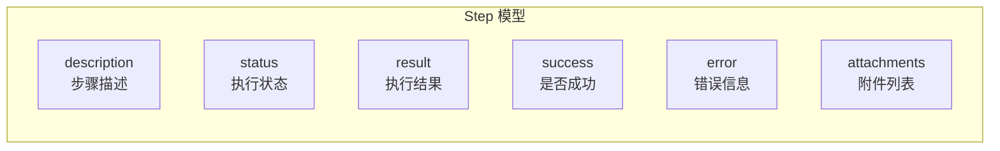

```python
class Step(BaseModel):
    description: str                    # 步骤描述
    status: ExecutionStatus = PENDING   # 执行状态
    result: Optional[str] = None        # 执行结果
    success: Optional[bool] = None      # 是否成功
    error: Optional[str] = None         # 错误信息
    attachments: List[str] = []         # 附件列表

class ExecutionStatus(str, Enum):
    PENDING = "pending"       # 待执行
    RUNNING = "running"       # 执行中
    COMPLETED = "completed"   # 已完成
    FAILED = "failed"         # 失败
```

### 状态转换

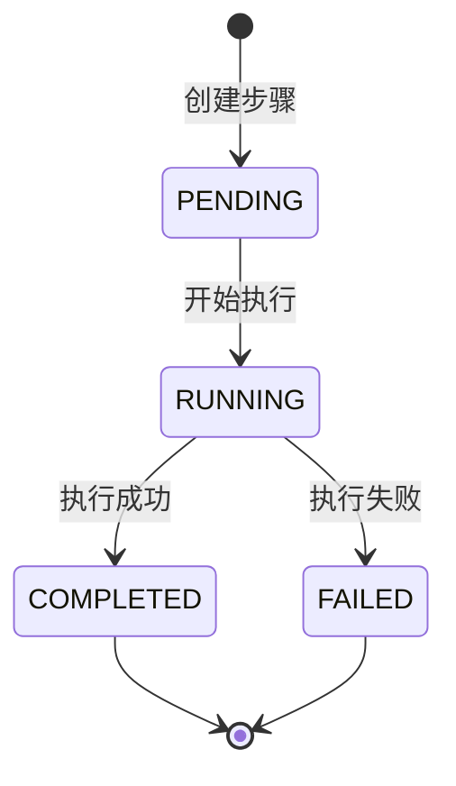

## 核心组件

### 1. Planner Agent

**职责**: 分析用户需求，生成和更新执行计划

**关键文件**: `backend/app/domain/services/agents/planner.py`

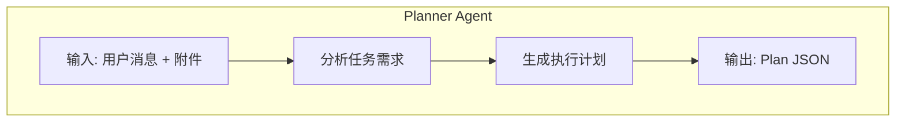

```python
class PlannerAgent(BaseAgent):
    name: str = "planner"
    format: Optional[str] = "json_object"  # 强制 JSON 输出
    tool_choice: Optional[str] = "none"    # 不调用工具

    async def create_plan(self, message: Message) -> AsyncGenerator[BaseEvent, None]:
        """根据用户消息创建执行计划"""
        prompt = CREATE_PLAN_PROMPT.format(
            message=message.message,
            attachments="\n".join(message.attachments)
        )
        async for event in self.execute(prompt):
            if isinstance(event, MessageEvent):
                # 解析 LLM 返回的 JSON
                parsed = await self.json_parser.parse(event.message)
                plan = Plan.model_validate(parsed)
                yield PlanEvent(status=PlanStatus.CREATED, plan=plan)

    async def update_plan(self, plan: Plan, step: Step) -> AsyncGenerator[BaseEvent, None]:
        """根据步骤执行结果更新计划"""
        prompt = UPDATE_PLAN_PROMPT.format(
            plan=plan.dump_json(),
            step=step.model_dump_json()
        )
        async for event in self.execute(prompt):
            if isinstance(event, MessageEvent):
                parsed = await self.json_parser.parse(event.message)
                updated_plan = Plan.model_validate(parsed)
                # 保留已完成步骤，替换待执行步骤
                # ...
                yield PlanEvent(status=PlanStatus.UPDATED, plan=plan)
```

### 2. Execution Agent

**职责**: 执行计划中的每个步骤，调用工具完成具体任务

**关键文件**: `backend/app/domain/services/agents/execution.py`

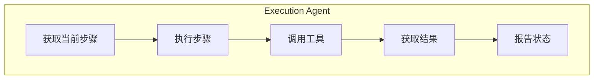

```python
class ExecutionAgent(BaseAgent):
    name: str = "execution"
    format: str = "json_object"

    async def execute_step(self, plan: Plan, step: Step, message: Message):
        """执行单个步骤"""
        prompt = EXECUTION_PROMPT.format(
            step=step.description,
            message=message.message,
            attachments="\n".join(message.attachments),
            language=plan.language
        )

        step.status = ExecutionStatus.RUNNING
        yield StepEvent(status=StepStatus.STARTED, step=step)

        async for event in self.execute(prompt):
            if isinstance(event, ToolEvent):
                # 工具调用事件
                yield event
            elif isinstance(event, MessageEvent):
                # 步骤完成
                step.status = ExecutionStatus.COMPLETED
                yield StepEvent(status=StepStatus.COMPLETED, step=step)
```

### 3. Base Agent

**职责**: 提供 Agent 基础能力，包括 LLM 调用、工具执行、状态管理

**关键文件**: `backend/app/domain/services/agents/base.py`

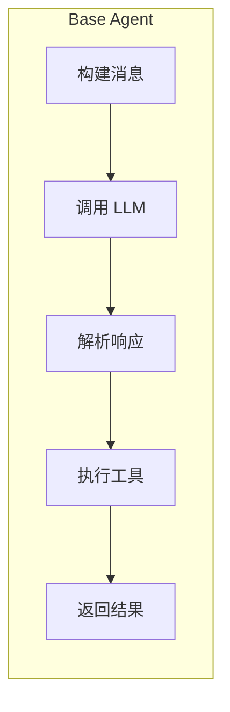

```python
class BaseAgent(BaseModel):
    agent_id: str
    llm: LLM
    tools: List[BaseTool]
    json_parser: JsonParser

    async def execute(self, message: str) -> AsyncGenerator[BaseEvent, None]:
        """执行 Agent 逻辑"""
        # 1. 构建消息历史
        messages = await self._build_messages(message)

        # 2. 调用 LLM
        response = await self.llm.ask(
            messages=messages,
            tools=self._get_tool_definitions(),
            response_format=self.format
        )

        # 3. 处理工具调用
        if response.get("tool_calls"):
            for tool_call in response["tool_calls"]:
                yield ToolEvent(status=ToolStatus.CALLING, ...)
                result = await self._execute_tool(tool_call)
                yield ToolEvent(status=ToolStatus.CALLED, result=result)

        # 4. 返回消息
        if response.get("content"):
            yield MessageEvent(message=response["content"])
```

## 执行流程详解

### 完整执行时序

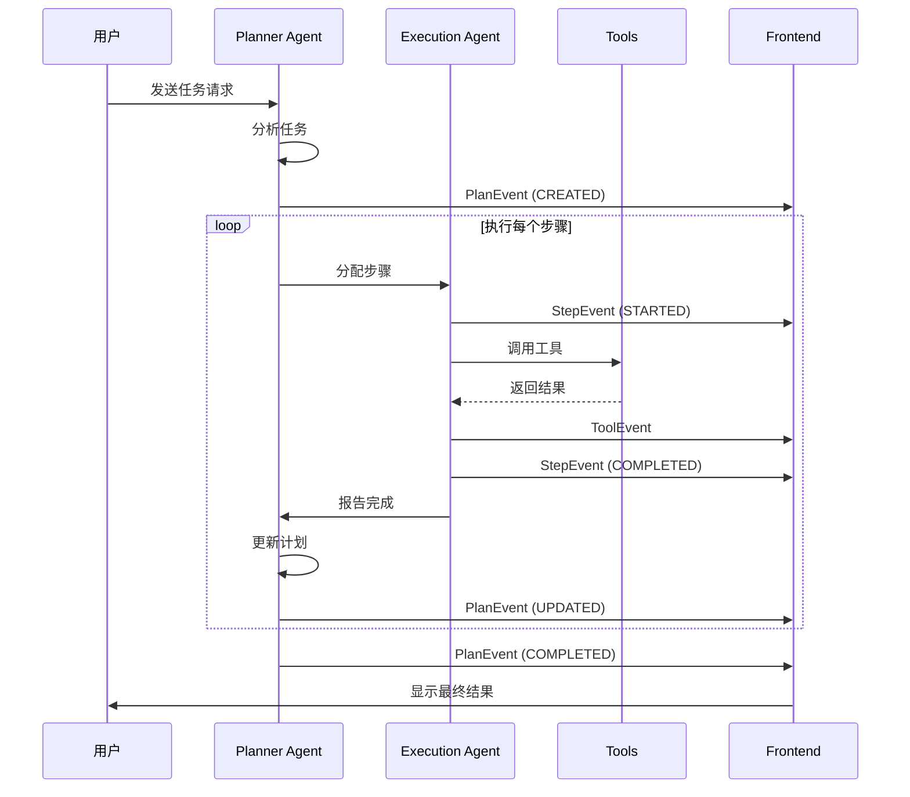

### 1. 计划创建阶段

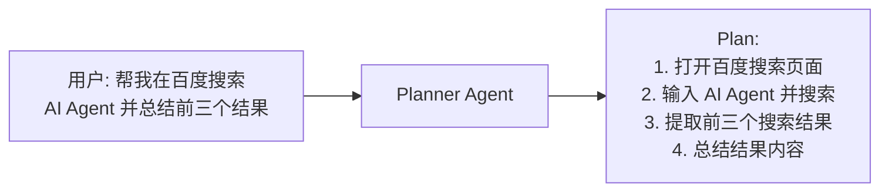

### 2. 步骤执行阶段

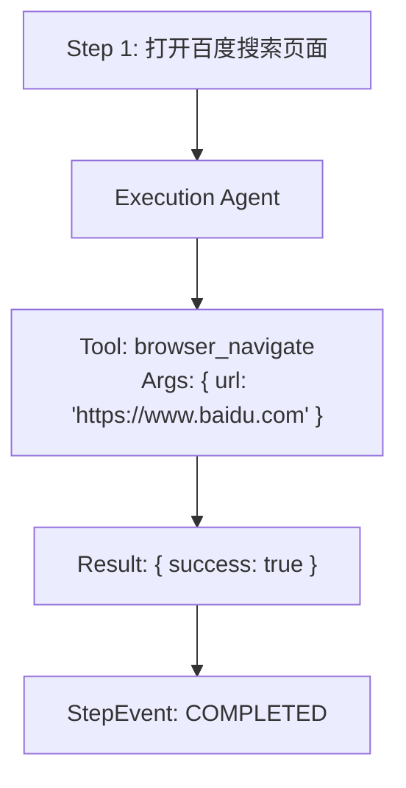

### 3. 计划更新阶段

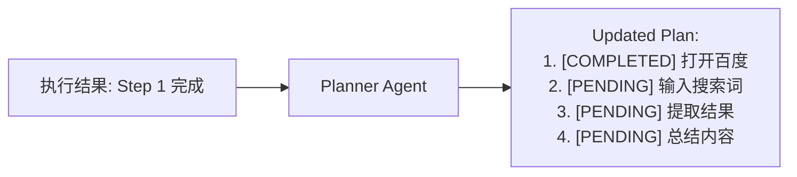

## 事件系统

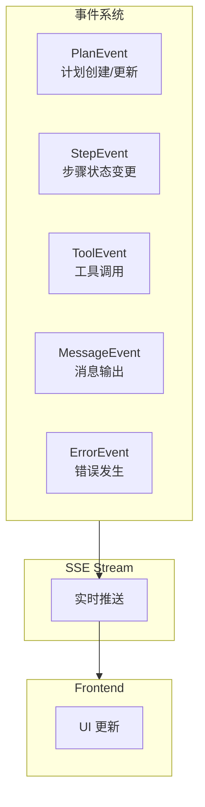

| 事件类型 | 说明 | 数据 |
|---------|------|------|
| `PlanEvent` | 计划创建/更新 | Plan 对象 |
| `StepEvent` | 步骤状态变更 | Step 对象 |
| `ToolEvent` | 工具调用 | 工具名称、参数、结果 |
| `MessageEvent` | 消息输出 | 文本内容 |
| `ErrorEvent` | 错误发生 | 错误信息 |

## Prompt 设计

### 创建计划 Prompt

```python
CREATE_PLAN_PROMPT = """
Based on the user's request, create an execution plan.

User request: {message}
Attachments: {attachments}

Output a JSON object with:
- title: Brief plan title
- steps: Array of step descriptions
- language: Response language (zh/en)
"""
```

### 更新计划 Prompt

```python
UPDATE_PLAN_PROMPT = """
Based on the execution result, update the remaining steps.

Current plan: {plan}
Completed step: {step}

Output updated steps array.
"""
```

## 关键文件

| 文件路径 | 功能 |
|---------|------|
| `domain/services/agents/planner.py` | Planner Agent 实现 |
| `domain/services/agents/execution.py` | Execution Agent 实现 |
| `domain/services/agents/base.py` | Agent 基类 |
| `domain/models/plan.py` | Plan/Step 模型定义 |
| `domain/services/prompts/planner.py` | Planner Prompt 模板 |
| `domain/services/prompts/execution.py` | Execution Prompt 模板 |
