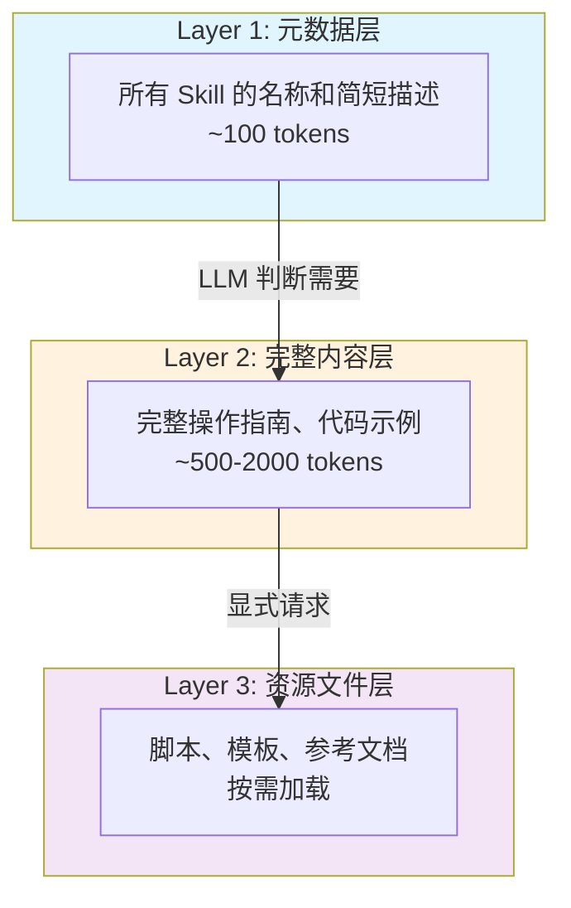
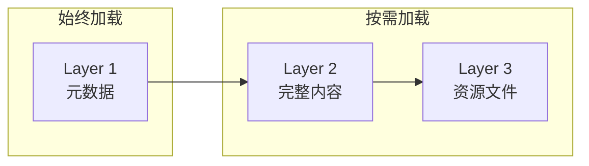
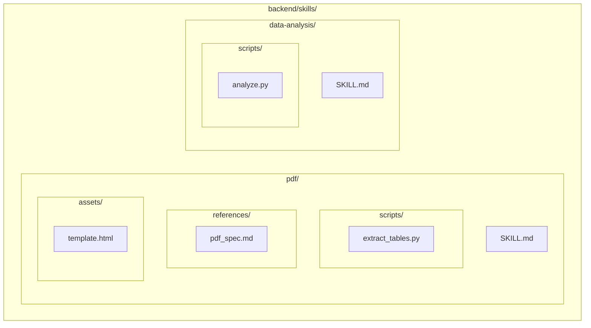
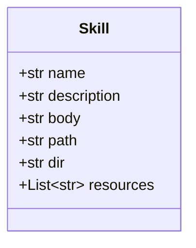
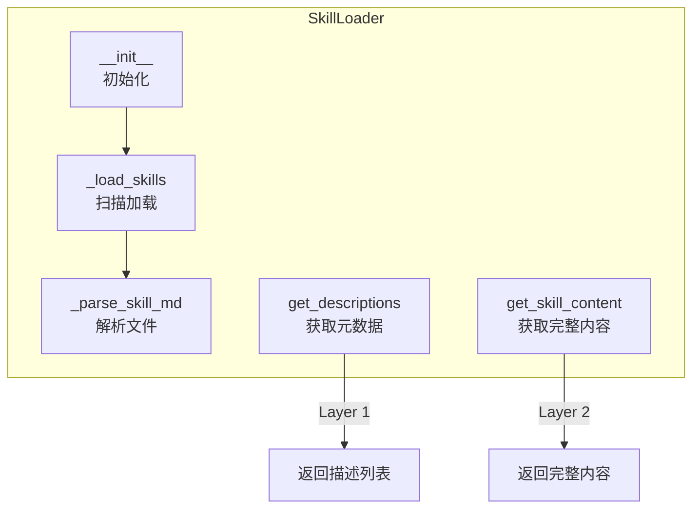
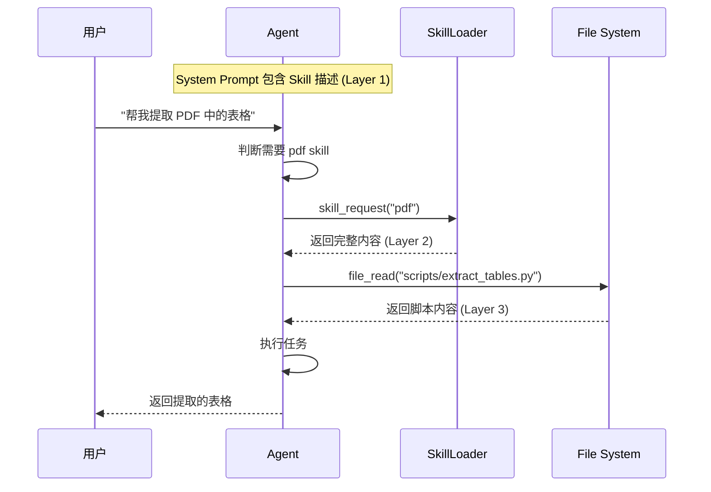
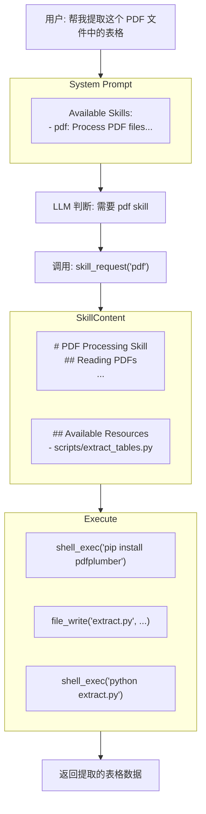
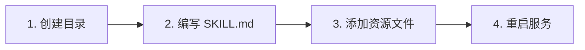
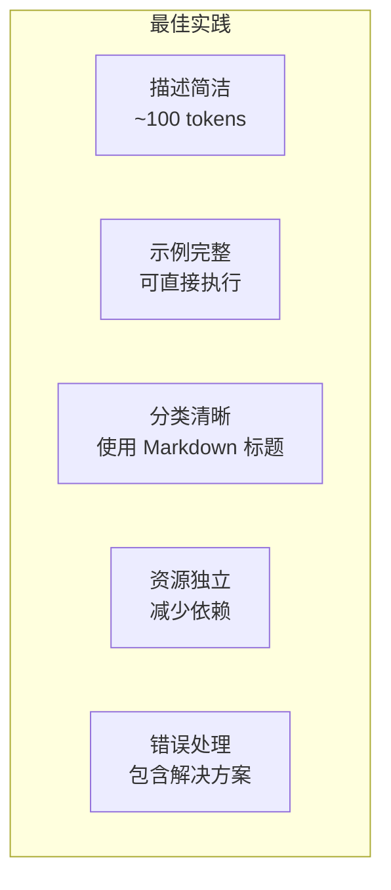

# Skill 实现原理

## 概述

Skill 系统为 ManusX 提供**领域专业知识注入**能力。通过 Skill，可以让 Agent 在特定领域（如 PDF 处理、数据分析等）拥有专业的操作指南和最佳实践。

## 设计理念

### 三层加载架构





### 各层详细说明

| 层级 | 加载时机 | 内容 | Token 消耗 |
|------|---------|------|-----------|
| **Layer 1** | 始终加载 | Skill 名称和简短描述 | ~100 |
| **Layer 2** | 按需加载 | 完整操作指南、代码示例 | ~500-2000 |
| **Layer 3** | 显式请求 | 脚本、模板、参考文档 | 按需 |

## 目录结构



```
backend/skills/
├── pdf/
│   ├── SKILL.md              # Skill 定义文件
│   ├── scripts/              # 可执行脚本
│   │   └── extract_tables.py
│   ├── references/           # 参考文档
│   │   └── pdf_spec.md
│   └── assets/               # 静态资源
│       └── template.html
└── data-analysis/
    ├── SKILL.md
    └── scripts/
        └── analyze.py
```

## SKILL.md 文件格式

每个 Skill 通过 `SKILL.md` 文件定义，采用 **YAML frontmatter + Markdown body** 格式：

```mermaid
flowchart TB
    subgraph SkillMD["SKILL.md 文件结构"]
        subgraph YAML["YAML Frontmatter"]
            Name["name: pdf"]
            Desc["description: Process PDF files..."]
        end
        subgraph Body["Markdown Body"]
            Title["# PDF Processing Skill"]
            Section1["## Reading PDFs"]
            Code["```python...```"]
            Section2["## Key Libraries"]
        end
    end

    YAML --> Body
```

```markdown
---
name: pdf
description: Process PDF files - extract text, read content, create PDFs, merge or split documents.
---

# PDF Processing Skill

You now have expertise in PDF file processing.

## Reading PDFs

### Using pdftotext (Recommended)

```bash
pdftotext input.pdf output.txt
```

### Using Python PyMuPDF

```python
import fitz
doc = fitz.open("input.pdf")
for page in doc:
    print(page.get_text())
```

## Key Libraries

| Library | Use Case |
|---------|----------|
| PyMuPDF | Read, write, merge |
| pdfplumber | Table extraction |
```

### 字段说明

| 字段 | 必填 | 说明 |
|------|------|------|
| `name` | 是 | Skill 唯一标识符 |
| `description` | 是 | 简短描述 (~100 tokens) |
| `body` | 是 | Markdown 正文内容 |

## 核心实现

### Skill 模型



```python
# backend/app/domain/models/skill.py

class Skill(BaseModel):
    name: str              # 唯一标识符
    description: str       # 简短描述
    body: str              # 完整内容
    path: str              # SKILL.md 文件路径
    dir: str               # Skill 目录路径
    resources: List[str]   # 可用资源文件列表
```

### SkillLoader 类



```python
# backend/app/domain/services/skill_loader.py

class SkillLoader:
    """加载和管理 Skill"""

    def __init__(self, skills_dir: Path):
        self.skills_dir = skills_dir
        self.skills: Dict[str, Skill] = {}
        self._load_skills()

    def _parse_skill_md(self, path: Path) -> Optional[Skill]:
        """解析 SKILL.md 文件"""
        content = path.read_text(encoding='utf-8')

        # 匹配 YAML frontmatter
        pattern = r"^---\s*\n(.*?)\n---\s*\n(.*)$"
        match = re.match(pattern, content, re.DOTALL)

        frontmatter = yaml.safe_load(match.group(1))
        body = match.group(2).strip()

        # 扫描资源文件
        resources = []
        for subdir in ['scripts', 'references', 'assets']:
            subdir_path = path.parent / subdir
            if subdir_path.exists():
                for f in subdir_path.rglob('*'):
                    if f.is_file():
                        resources.append(str(f.relative_to(path.parent)))

        return Skill(
            name=frontmatter['name'],
            description=frontmatter['description'],
            body=body,
            path=str(path),
            dir=str(path.parent),
            resources=resources
        )

    def get_descriptions(self) -> str:
        """获取所有 Skill 的元数据描述 (Layer 1)"""
        return "\n".join(
            f"- {s.name}: {s.description}"
            for s in self.skills.values()
        )

    def get_skill_content(self, name: str) -> Optional[str]:
        """获取完整 Skill 内容 (Layer 2)"""
        skill = self.skills.get(name)
        if not skill:
            return None

        content = skill.body
        if skill.resources:
            content += f"\n\n## Available Resources\n"
            content += f"Directory: {skill.dir}\n"
            for r in skill.resources:
                content += f"- {r}\n"
        return content
```

## 使用流程

### 完整流程时序图



### 1. System Prompt 注入 (Layer 1)

```python
# 在构建 System Prompt 时注入 Skill 描述
if skill_loader.has_skills():
    system_prompt += f"""

## Available Skills

You have access to the following domain expertise:
{skill_loader.get_descriptions()}

When a task matches a skill, request its full content.
"""
```

### 2. LLM 请求 Skill (Layer 2)

当 LLM 判断需要使用某个 Skill 时，通过 `skill_request` 工具请求完整内容：

```python
@tool(name="skill_request")
async def skill_request(self, skill_name: str) -> ToolResult:
    """请求加载特定 Skill 的完整内容"""
    content = skill_loader.get_skill_content(skill_name)
    if content:
        return ToolResult(success=True, data={"content": content})
    return ToolResult(success=False, message=f"Skill '{skill_name}' not found")
```

### 3. 读取资源文件 (Layer 3)

LLM 可通过 `file_read` 工具读取 Skill 目录下的资源文件：

```python
# LLM 调用
file_read(file="/path/to/skills/pdf/scripts/extract_tables.py")
```

## 执行流程图



## 创建新 Skill



### 1. 创建目录结构

```bash
mkdir -p backend/skills/my-skill/{scripts,references,assets}
```

### 2. 编写 SKILL.md

```markdown
---
name: my-skill
description: Brief description of what this skill does (~100 tokens)
---

# My Skill Title

Detailed instructions for the LLM.

## Section 1

Instructions and code examples...

## Section 2

More instructions...
```

### 3. 添加资源文件 (可选)

```bash
# 脚本
echo "print('Hello')" > backend/skills/my-skill/scripts/helper.py

# 模板
echo "<html>...</html>" > backend/skills/my-skill/assets/template.html
```

### 4. 重启服务

Skill 会在服务启动时自动加载。

## 最佳实践



1. **描述简洁**: `description` 字段控制在 100 tokens 以内
2. **示例完整**: 提供可直接复制执行的代码示例
3. **分类清晰**: 使用 Markdown 标题组织内容
4. **资源独立**: 脚本应可独立运行，减少依赖
5. **错误处理**: 包含常见错误的解决方案

## 关键文件

| 文件路径 | 功能 |
|---------|------|
| `domain/models/skill.py` | Skill 模型定义 |
| `domain/services/skill_loader.py` | Skill 加载器 |
| `skills/*/SKILL.md` | 各 Skill 定义文件 |
